# 16S Datasets

We're going to walk through a couple of different analyses of 16S datasets using two different tools, [QIIME](http://www.qiime.org/) and [Calypso](http://cgenome.net/wiki/index.php/Calypso)

# QIIME

Please note: We do not provide QIIME by default on the images since it requires a significant amount of space. QIIME is [quite easy to install](https://docs.qiime2.org/2018.11/install/) and the QIIME developers provide a number of preconfigured [QIIME AWS instances](https://s3-us-west-2.amazonaws.com/qiime2-data/distro/core/aws-amis.txt) that you should be able to start from your account. 

To start a QIIME AWS image:

1. Log into your AWS account
2. Set the region to `US Oregon`. Note that is the only region supported by the QIIME developers at the moment
3. Click the `Launch` button to launch a new instance.
4. Under `Community AMIs` type `QIIME` in the search box. This will list the available AMIs. Use the appropriately latest version of the AMI
5. You should be able to use a `t2-micro` instance (one of the free tier instances) for this image.
6. Once the instance has launched you can continue with this tutorial.

**Note:** The qiime2 images require a username and password. The username is `qiime2` and the password is `qiime2`. If, like me, you have AWS set up to use keys, you may need to tell ssh to temporarily ignore them. For example:

```bash
ssh -o PubkeyAuthentication=no qiime2@54.187.96.46
```

will login to  a machine with the IP address `54.187.96.46` using the username `qiime2` and request a password from you.

Please note there are lots of [tutorials](https://docs.qiime2.org/2018.11/tutorials/) available on the QIIME website that walk you through different aspects of QIIME. This tutorial is designed to introduce you to some of the concepts.

## Organisms in a drinking water sample

We have [summarized data](../Datasets/drinking_water) from a  drinking water study from the University of Adelaide, Australia. The data comes from [this study](https://www.ncbi.nlm.nih.gov/Traces/study/?acc=SRP059994).

The metadata is also available in [tab-separated format](../Datasets/drinking_water/metadata.tsv) and we have a version for [Calypso](../Datasets/drinking_water/metadata_calypso.tsv). (See below for the [Calypso tutorial](#Calypso)).

To import the data into QIIME, you need the sequences.fastq.gz and barcodes.fastq.gz in a directory by themselves. You can download these files from the [drinking water](../Datasets/drinking_water/) directory. For this data, I created a script called split.py which reads all the sequences and splits them based on their barcodes. Notice that in /data/drinking_water/fastq we have selected just 20,000 sequences as a subsample of the data so that you can process the data quickly and efficiently. The entire data set is in /data/drinking_water/fastq_original in case you want to try and run the whole analysis.

Lets walk through running this through QIIME. 

0. start qiime and create a directory for the analysis

```
mkdir -p ~/drinking_water/sequences
cd ~/drinking_water/
```

And now we download the sequences from GitHub:

```bash
curl -Lo sequences/barcodes.fastq.gz https://goo.gl/B58F7M
curl -Lo sequences/sequences.fastq.gz https://goo.gl/tVxpGf
curl -Lo metadata.tsv https://goo.gl/U5zUWQ
```

*Note 1:* these short Google URLs just point to the GitHub repository of the data, but they are easier to copy and paste!
*Note 2:* make sure you include -L on the curl command as curl will need to follow the redirect from Google to GitHub etc!

Now we have a directory called sequences that has the sequence data, and the metadata in our own file, so the directory structure looks like this:

```
drinking_water/
drinking_water/metadata.tsv
drinking_water/sequences/
drinking_water/sequences/barcodes.fastq.gz
drinking_water/sequences/sequences.fastq.gz

```

We are in the directory `drinking_water`, and we can walk through analyzing those sequences:

1\. Import the sequences into qiime

```
qiime tools import --type EMPSingleEndSequences --input-path sequences/ --output-path drinking_water.qza
```
Once that is complete you should get the message:

```text
Imported sequences/ as EMPSingleEndDirFmt to drinking_water.qza
```


2\. Demultiplex the sequences. This separates the sequences based on the barcodes. As we noted in [the description](../Datasets/drinking_water), this data set contains reads from five different sequencing runs, each of which comes from a different sample, either a drinking water site or related site.

```
qiime demux emp-single --i-seqs drinking_water.qza --m-barcodes-file metadata.tsv --m-barcodes-column Tag --o-per-sample-sequences demultiplex.qza
```

Upon success you should see:

```text
Saved SampleData[SequencesWithQuality] to: demultiplex.qza
```

3\. Summarize that data and make a visualization file:

```bash
qiime demux summarize --i-data demultiplex.qza --o-visualization demultiplex.qzv
```

When this is complete you should see this message:

```text
Saved Visualization to: demultiplex.qzv
```

4\. Let’s visualize that file by uploading it to the [QIIME2 website](https://view.qiime2.org/). Start by copying the qzv file onto your computer:

```bash
scp -o PubkeyAuthentication=no qiime2@54.187.96.46:drinking_water/demultiplex.qzv .
```
*Note 1:* remember, the password is qiime2 if you used their image
*Note 2:* change the IP address to that of your AWS instance

Then you can drag and drop the file to the [QIIME2 visualization website](https://view.qiime2.org/).

The sequence count summary should tell you that there are 20,000 sequences per sample:


Sample name | Sequence count
--- | ---
SRR2080436 | 20,000
SRR2080434 | 20,000
SRR2080427 | 20,000
SRR2080425 | 20,000
SRR2080423 | 20,000

If you click on "Interactive quality plot" in the top left you will see a plot like this:

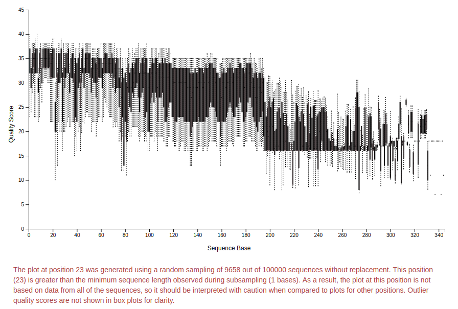

You can zoom in and out in the plot and look at the quality of the sequences.

Based on this plot and the information in red (read it!) we will trim to 195 bp using dada2. This removes low quality sequences so we are sure that we are finding the right organisms.

5\. denoise that with dada2:

```bash
qiime dada2 denoise-single --i-demultiplexed-seqs demultiplex.qza --p-trim-left 0 --p-trunc-len 195 --output-dir dada
```

When this has run, you get a new directory, `dada` with three output files in it. The output reports:

```text
Saved FeatureTable[Frequency] to: dada/table.qza
Saved FeatureData[Sequence] to: dada/representative_sequences.qza
Saved SampleData[DADA2Stats] to: dada/denoising_stats.qza
```

These are QIIME format binary files, and so you can't easily read them. If you are curious, the files are [zip archives](https://en.wikipedia.org/wiki/Zip_(file_format)), so you can make a copy of the file into a temporary directory, `unzip` it, and poke around in the files.

6\. Summarize the feature table and feature data

```bash
qiime feature-table summarize --i-table dada/table.qza --o-visualization table.qzv --m-sample-metadata-file metadata.tsv
qiime feature-table tabulate-seqs --i-data dada/representative_sequences.qza --o-visualization rep-seqs.qzv
```

7\. Again, you can view those two files using the [QIIME2 viewer](https://view.qiime2.org/). You will need to copy the two `.qzv` files to your computer and you can drop them onto the upload link.


The **representative sequences** file contains information about sequences that represents the different groups in your data. 

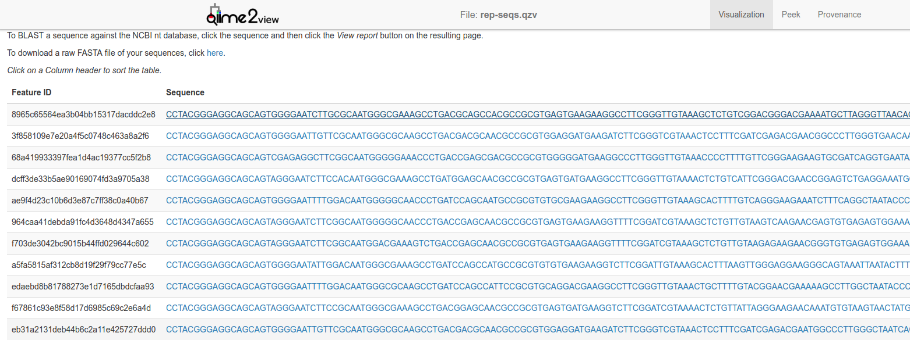

You can click on any of those sequences to BLAST them at the [NCBI website](http://www.ncbi.nlm.nih.gov/blast), and you can also view the provenance of the sequences:

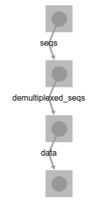

The **table** file summarizes information about the sequences.

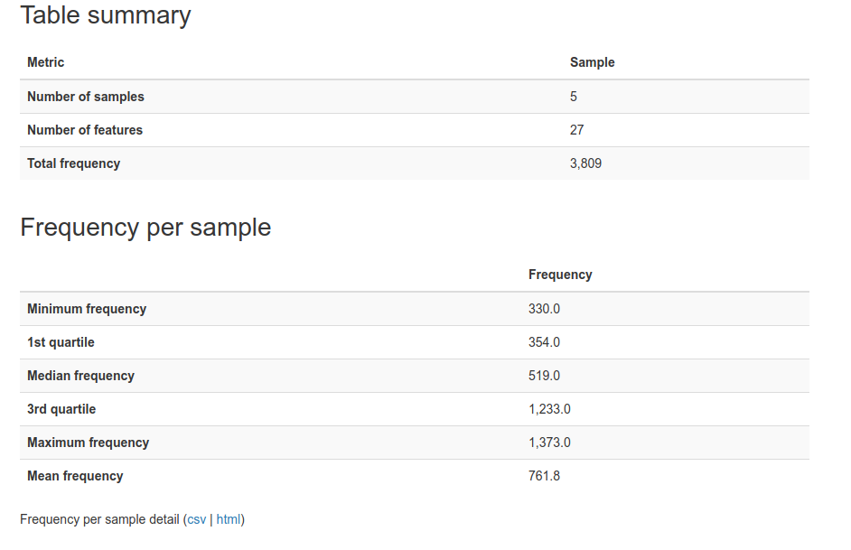

Now that we have looked at the data summaries, we can explore the data in more detail. Lets start with a tree:

8\. Generate the phylogenetic tree. We need to start with an alignment of the data:

```bash
qiime alignment mafft --i-sequences dada/representative_sequences.qza --o-alignment aligned-rep-seqs.qza
```

However, when we're building trees, we want to ignore some really variable regions, and we can do that with a mask:

9\. Mask highly variable positions

```bash
qiime alignment mask --i-alignment aligned-rep-seqs.qza --o-masked-alignment masked-aligned-rep-seqs.qza
```

And then we can make a phylogenetic tree of this data

10\. Use fasttree to build a tree

```bash
qiime phylogeny fasttree --i-alignment masked-aligned-rep-seqs.qza --o-tree unrooted-tree.qza
```


11\. Add a mid-point root to the tree:

``` bash
qiime phylogeny midpoint-root --i-tree unrooted-tree.qza --o-rooted-tree rooted-tree.qza
```

We now have a phylogenetic tree of our data that we can explore. QIIME does not (currently) provide a mechanism to visualize this tree, but if you explore the files as I describe above, you can visualize a tree like this:

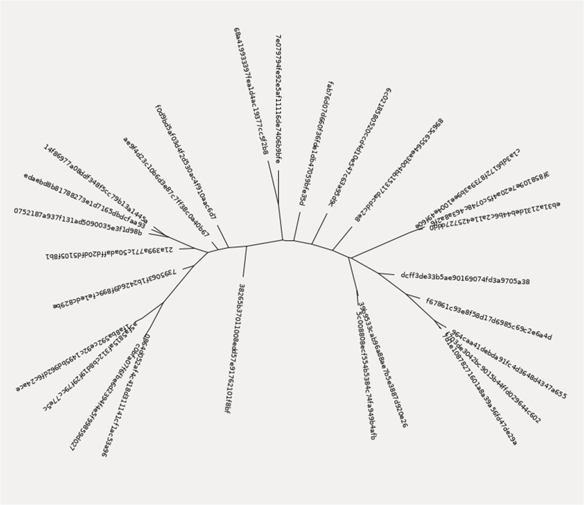

In addition to making some trees, we can also use the **representative reads** to generate a classification of our data. To do this, we use one of the [QIIME machine learning models](https://docs.qiime2.org/2018.11/data-resources/#taxonomy-classifiers-for-use-with-q2-feature-classifier) that they have already trained to classify data sets. In this example, we use the Greengenes 13_8 99% OTUs full-length sequences to test our data.

12\. Generate the taxonomy based on this tree using a machine learning classifier

First, we need to download the file of trained classifiers

```bash
curl -Lo gg-13-8-99-nb-classifier.qza https://goo.gl/ZDg8eH
```

and now we can run the classifier and use that to create a table of the output

```bash
qiime feature-classifier classify-sklearn --i-classifier gg-13-8-99-nb-classifier.qza --i-reads dada/representative_sequences.qza --o-classification taxonomy.qza
qiime metadata tabulate --m-input-file taxonomy.qza --o-visualization taxonomy.qzv
```

13\. Finally, we want to export this to tab separated values so we can load the classified data into excel or open office and use it to make graphs for our paper:

```bash
mkdir exported
qiime tools export --input-path taxonomy.qza --output-path exported
qiime tools export --input-path dada/table.qza --output-path exported
```

The two export commands create different files:
The first command outputs  the taxonomy as tab separated files into  a file called `taxonomy.tsv`. This has three columns, the taxonomy ID, the taxonomy string, and the confidence in that identification. 

The taxonomy string looks something like:
```text
k__Bacteria; p__Actinobacteria; c__Actinobacteria; o__Actinomycetales; f__Propionibacteriaceae; g__Propionibacterium; s__acnes
```

These are the [taxonomic rank](https://en.wikipedia.org/wiki/Taxonomic_rank) kingdom, phyla, class, order, family, genus, and species, abbreviated as k_/p_/c_/o_/f_/g_/s_.

The second export command exports the features in [Biological Observation Matrix (BIOM) format](http://biom-format.org/). This is useful for importing into other programs. 


# Calypso

Calypso is an easy-to-use online software, allowing non-expert users to mine, interpret and compare taxonomic information from metagenomic or 16S rDNA datasets ([Zakrzewski et al., 2017](https://academic.oup.com/bioinformatics/article/33/5/782/2627437)). The [Calypso Web Site](http://cgenome.net/wiki/index.php/Calypso) has lots of options for statistical analysis of metagenomes.

To upload your data to Calypso, you will need three files. These are the same files created above, but we have also provided them for download, too

* [taxonomy.tsv](../Datasets/drinking_water/Calypso/taxonomy.tsv)
* [feature-table.biom]((../Datasets/drinking_water/Calypso/feature-table.biom)
* [metadata](metadata_calypso.tsv)


Start at http://cgenome.net/wiki/index.php/Calypso 

Click on the Start Using Calypso button:

[](http://cgenome.net:8080/calypso-8.84/faces/uploadFiles.xhtml)

and then in the right hand pane, we are going to upload our data:

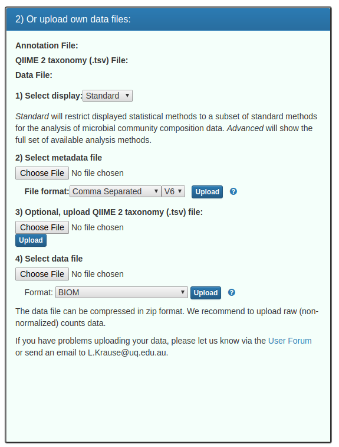

**Notes about this form:**

1\. Leave display as standard
2\. Upload the metadata_calypso.tsv metadata file. **NB:** this is a tab-separated V6 format metadata file. You should see a green message:

3\. Upload the taxonomy.tsv file that you exported from QIIIME2. You should see a green message:

4\. Upload the feature-table.biom file as a biom format file. You should see a green message:

5\. Click the next button


On the next page, leave the data filtering box alone:

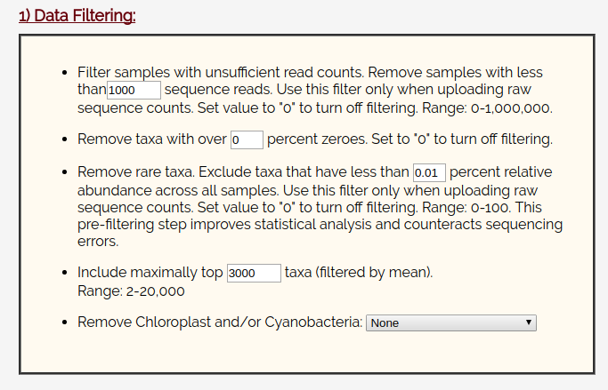

And leave the data normalization set to TSS checked and Square Root.
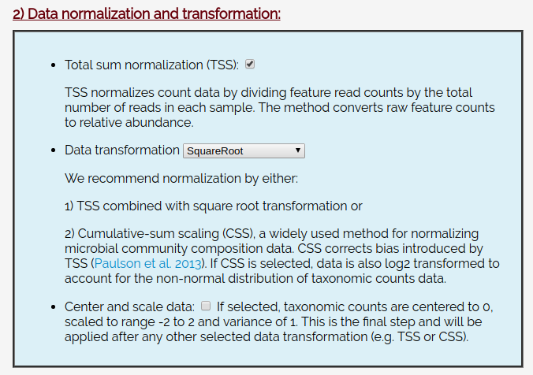

Click Filter and Normalize:


After a few seconds, you should see:

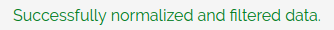

You’ll be provided with the ability to upload any optional files.
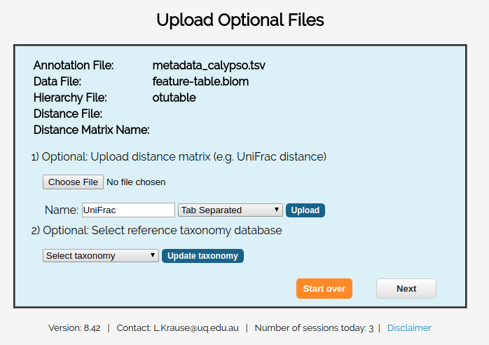

 For this example, we don't have any optional files, so you can just click skip.
 
 Now you will be provided with a summary of your data:
 
 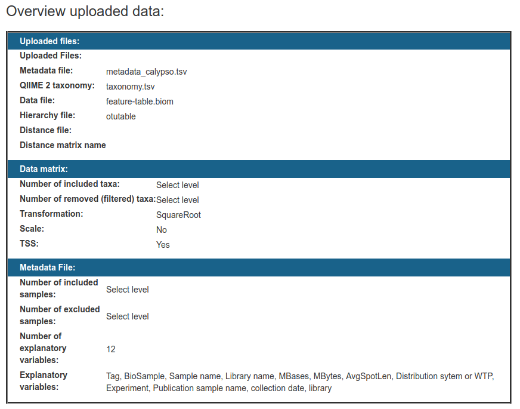
 
 And begin to explore these statistical tools:


You should explore each of them and see what they have to offer!


&nbsp;

&nbsp; 


# Adjusting 16S abundance for copy number

Note that different organisms have different numbers of 16S genes, that skews 16S surveys. For example, E. coli has seven copies of the 16S gene, and Vibrio could have up to 13 copies of the 16S gene (https://www.ncbi.nlm.nih.gov/pubmed/19341395). We strongly recommend you read the CopyRighter paper (https://www.ncbi.nlm.nih.gov/pmc/articles/PMC4021573/) and consider how the abundance of 16S genes in different organisms affects your conclusions.

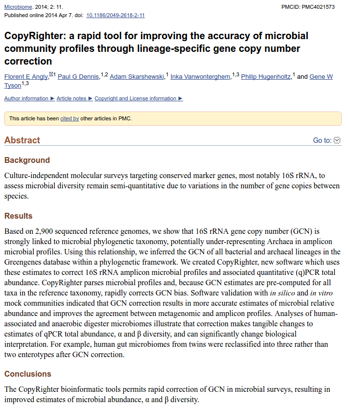

However, apparently this remains an [unsolved problem in bioinformatics](https://microbiomejournal.biomedcentral.com/articles/10.1186/s40168-018-0420-9), and maybe you should consider working on it.

# What is an OTU?

In 16S sequencing people often cluster the data at some level of similarity, and call that an *Operational Taxonomic Unit* or *OTU*. Transitionally, 97% similarity was used, and there is actually a biological argument in support of that cutoff: homologous recombination is restricted to DNA sequences that are >= 97% identical and below that level of similarity homologous recombination is rare (Zahrt TC, Maloy S. 1997. [Barriers to recombination between closely related bacteria: MutS and RecBCD inhibit recombination between Salmonella typhimurium and Salmonella typhi](http://www.pnas.org/content/94/18/9786.short). Proc Natl Acad Sci U S A 94:9786–9791.). This would suggest that sequences that are >97% similar are from the same "*species*" since the organisms can have "*sex*" with each other and efficiently share their DNA<sup>1</sup>. However, the 16S *rRNA* gene is so constrained, that the rest of the genome will be much less similar than 97%.

More recently, however, several groups have questioned the utility of the 97% cutoff in 16S sequences. For example, [Edgar argues that the cutoff should be 99% or 100%](https://academic.oup.com/bioinformatics/article-abstract/34/14/2371/4913809?redirectedFrom=fulltext), Konstantinos Konstantinidis [crticized OTU clustering as underestimating diversity](https://aem.asm.org/content/84/6/e00014-18), and QIIME2 has moved [away from OTU clustering](https://microbiomejournal.biomedcentral.com/articles/10.1186/s40168-018-0470-z) including in [tutorials](https://docs.qiime2.org/2018.11/tutorials/otu-clustering/). 
