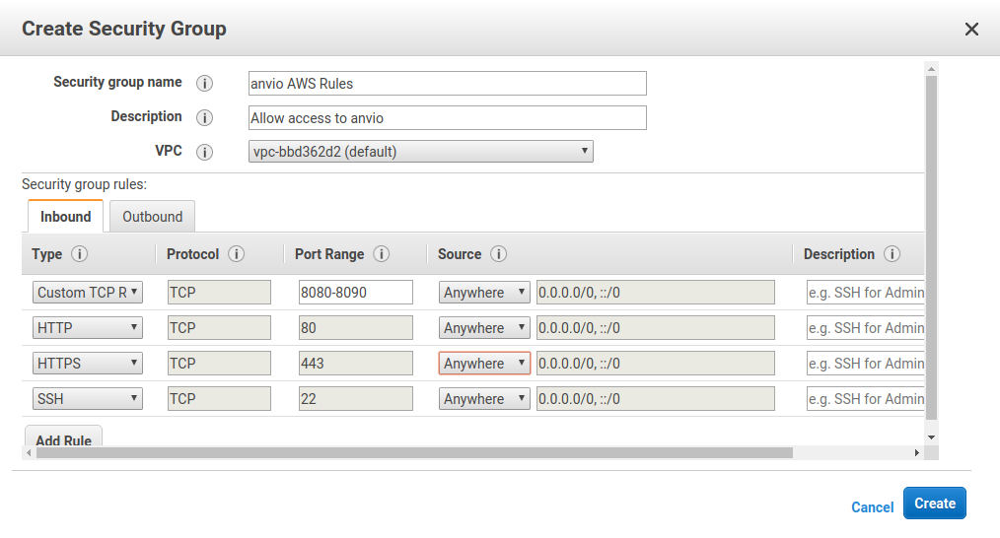

# Creating security rules for AWS instances.

AWS images are set up by default so that you can only access them via SSH. This is a security issue, you don't want malicious actors using all your resources. In order to access the instance to see, for example, results from anvi'o, we need to add a new set of security rules.

In the left hand pane of the AWS EC2 Dashboard, click **Security Groups** under **Network and Security**.

Next, click the blue **Create Security Group** button.

We need to add four inbound rules:
1. A rule for ports 8080-8090 to be open. anvi'o usually uses 8080, but that may increment to 8081, 8082, ... if the earlier ports are busy.
2. Rules for both http (port 80). This is normal web traffic
3. Rules for https (port 443). This is secure (encrypted) web traffic.
4. A rule to allow SSH - so that you can access the machine!

Create each of these rules so that your inbound tab looks like this:

.

*Note 1:* for http/https/ssh you can just choose them from the pull down menu on the left.

*Note 2:* In this example, I have opened the ports up to the world. This is **bad**. A much more secure alternative is to choose **My IP** from the second pull down menu (where it shows **Anywhere** in the example). This will restrict access to the server from your current IP. 

That is the most secure option, and you should choose **My IP**. However, if you move locations, you'll need to add another rule, just like this.

You don't need to change the *outbound* rules, you can leave them looking like:

Click Create the rules.

## Apply the rules to your instance.

Head to the **instances** overview in the dashboard and choose your instance so that the checkbox next to it goes blue.

From the **Actions** menu choose **Networking** &rarr; **Change Security Groups**. 

Choose your new security group and click apply.

Once anvi'o tells you that a server is listening, you should now be able to open your browser, type the IP address (that you can get from the instances overview) and see the visualization.