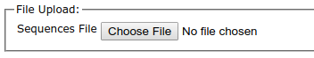
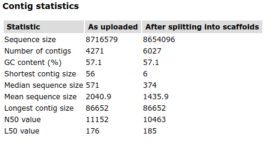
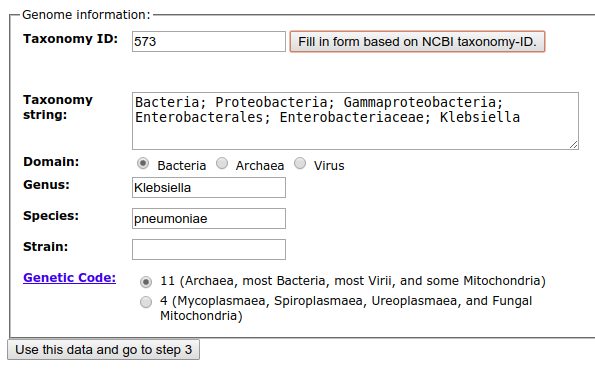
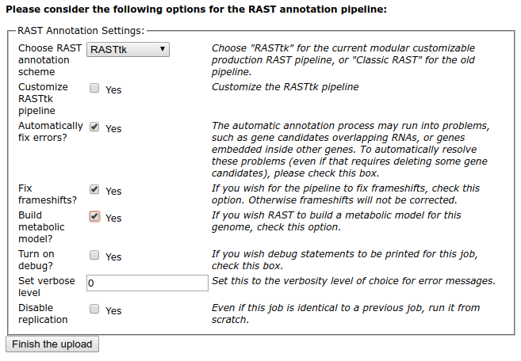

# Annotation Pipelines

There are a few robust and well designed microbial genome annotation pipelines that you can use to analyze your genome sequences. Each has its own benefits and drawbacks, and these may dictate which pipeline you end up using.

* [RAST](http://rast.nmpdr.org/)
* [PROKKA](https://github.com/tseemann/prokka)
* [PATRIC](https://patricbrc.org/)
* [NCBI PGAP](https://www.ncbi.nlm.nih.gov/genome/annotation_prok/)

## Creating an assembled genome to annotate

The same approach that we have talked about in other modules was used to generate a test dataset, namely, [downloading fastq data from SRA](../Databases/SRA) and then [assembling the data with spades](../.SequenceAssembly/). To summarize, these are the commands that were used.

I downloaded the reads from [ERS012013](https://www.ncbi.nlm.nih.gov/sra/?term=ERS012013), which is part of Kat Holt's *Klebsiella* dataset (Project ID [PRJEB2111](https://www.ncbi.nlm.nih.gov/bioproject/PRJEB2111)), and assembled them using spades.

```bash
fastq-dump --outdir fastq --gzip --skip-technical  --readids --read-filter pass --dumpbase --split-3 --clip ERS012013
spades.py -o assembly -1 fastq/ERS012013_pass_1.fastq.gz -2 fastq/ERS012013_pass_2.fastq.gz

```

Statistic | Value
--- | ---
Number of sequences | 4271
Total length | 8,716,579
Shortest contig | 56
Longest contig | 86,652
N<sub>50</sub> | 11,152
N<sub>75</sub> | 28,825


In all the cases below we use the `scaffolds.fasta` output from spades for subsequent analysis.

## Example annotation using RAST

Start at the [RAST website](https://rast.nmpdr.org/) and from `Your Jobs`  choose `Upload a new Job`. This opens up the file chooser page, and at the file chooser



select your `scaffolds.fasta` file. After that file is uploaded, you are presented with a summary of the contigs. Note that RAST may split some of the scaffolds that spades generated, and thus you may have slightly more contigs and slightly shorter sequence size, as shown here. The split happens on runs of `N` bases that spades inserts where it can estimate gaps between contigs based on sequence overlap.



The bottom of this page asks for information about the organism you have sequenced. If you enter the taxid, as shown here, the form should populate with information from NCBI.



There a series of questions about the annotation pipeline. Two recommended options are to build metabolic models and fix frameshifts, especially if you have a draft genome. Fixing frameshifts is controversial because some genomes (notably *Salmonella enterica serovar Typhi*) have a large number of frameshifts that are an evolutionary trait!



*Note*: at this stage you can also choose to customize some of the options for the RAST pipeline.


## Example annotation using PROKKA

*Note*: The [PROKKA GiutHub Site](https://github.com/tseemann/prokka) contains many other recipes and advances options for annotating the `scaffolds.fasta` file using PROKKA.


## Example submission using PATRIC

To annotate the contigs using PATRIC, I first go to the [PATRIC website](https://patricbrc.org/) and log in. If you don't have an account you will need to create one.

Create a new workspace called `Klebsiella` by clicking on the `Workspaces` menu and going to your `home` directory, and then clicking on the   new folder icon on the top right.

Then use the `p3` commands to submit the `scaffolds.fasta` file for annotation as a genome. You will need to [follow these installation instructions](https://docs.patricbrc.org/cli_tutorial/cli_installation.html) to install the `p3` commands, and at the moment they do not provide a CentOS version so it they are not included on the AWS instance.

Once you have installed `p3`, you will need to login:
```
p3-login
```

and provide the same credentials that you use for the website.

For the command, we need to provide several variables:

Variable | Definition
---|---
--contigs-file | the source of the contigs (probably scaffolds.fasta from spades output)
-n | the name we want to use for our genome
-t | the [NCBI Taxonomy ID](https://www.ncbi.nlm.nih.gov/taxonomy). For *Klebsiella pneumoniae* this is [573](https://www.ncbi.nlm.nih.gov/Taxonomy/Browser/wwwtax.cgi?id=573). <br />This is used to ensure that the correct parameters are used for the annotation processes.
-d | the domain (Bacteria, Archaea, Eukarya, or Virus)

Then we provide the workspace and the file name to call it in the workspace. 

```bash
p3-submit-genome-annotation --contigs-file scaffolds.fasta -n "Klebsiella pneumoniae NT211489B" -t 573 -d Bacteria /redwards@patricbrc.org/home/Klebsiella "Klebsiella pneumoniae NT211489B"
```


