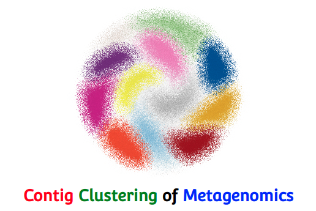

# Binning using CCOM

 
 As an alternative to manual binning using `crAss`, and using `metabat`, we have developed a website, [Contig Clustering of Metagenomes](https://edwards.sdsu.edu/ContigClustering) where you can upload reads and contigs, and we will run three different binning algorithms: [metabat](https://bitbucket.org/berkeleylab/metabat), [GroopM](http://minillinim.github.io/GroopM/) and [crAss](http://edwards.sdsu.edu/crass/).
 
The input files for CCOM require a `contig` file that has to have `.fasta` extension, and all the individual read files used as input to form the contig. For example for the algae data, we have the `contigs.fasta` file, and all the individual reads files `Algae_11.renum.fna`, `Algae_12.renum.fna`, `Algae_13.renum.fna`, `Algae_14.renum.fna` files. 

*Note*: The extension of the read files must be changed from `.fasta` to `.fna`, this doesn’t change the file format but allows the CCOM tool recognize the reads file from the contig file. Only one set can be run at a time (i.e. you can not run multiple contig files at the same time), but you can upload several independent datasets and wait for them to be processed.. 

The output from CCOM is saved in a zip file called `workfile.zip` that you can download. 

Unzip the file and navigate to `/workfile/var/www/html/ContigClustering/cgi-bin/ContigClustering/uploads/XXXXXXXX`. The `XXXXXXXX`  will be a Job ID number that is created by CCOM and is unique to you. This file contains all the temporary files (`.bam`, `.bai` and `.sam` files) generated while running the binning tools. The bins extracted from the contigs are saved in the the folders: MetaBatBins, GroopMBins. 

