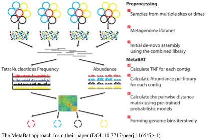

# Binning using MetaBat

One of the most popular programs for binning metagenomes is using [metabat](https://bitbucket.org/berkeleylab/metabat). 

Metabat does the profiling for you based on tetranucleotide frequency in the samples. It counts the 4-mers, (i.e. `AAAA`, `AAAT`, `AAAG`, `AAAC`, `AATA`, `AATT`, `…`) in the sequences and uses those to suggest which samples should go together. The advantage of `metabat` is that it will return your contigs for you. 



Metabat requires one `bam` file for every input sample, and one set of contigs. We can use our existing datasets to try binning with metabat, but we need to map the individual reads to the contigs in separate files (in the previous analysis we mapped all the reads to the contigs in one big file).

You can use four pairs of commands to do this (these four commands should each be on a single line):

```bash
bowtie2 -f  -x AlgaeBowtie -U Algae_11.renum.fna > Algae_11.renum.fna.AllReads.sam
samtools view -bS  Algae_11.renum.fna.AllReads.sam  | samtools 
sort – Algae_11..fna.AllReads

bowtie2 -f  -x AlgaeBowtie -U Algae_12.renum.fna > Algae_12.renum.fna.AllReads.sam
samtools view -bS  Algae_12.renum.fna.AllReads.sam  | samtools 
sort – Algae_12.renum.fna.AllReads

bowtie2 -f  -x AlgaeBowtie -U Algae_13.renum.fna > Algae_13.renum.fna.AllReads.sam
samtools view -bS  Algae_13.renum.fna.AllReads.sam  | samtools 
sort – Algae_13.renum.fna.AllReads

bowtie2 -f  -x AlgaeBowtie -U Algae_14.renum.fna > Algae_14.renum.fna.AllReads.sam
samtools view -bS  Algae_14.renum.fna.AllReads.sam  | samtools  
sort – Algae_14.renum.fna.AllReads
```


However, this sort of repetitive work is exactly what computers are good at, and so we can have the computer do it for us all at once (make sure you change the Algae part as appropriate):

```bash
for FASTA in Algae_*renum.fna; do bowtie2 -f  -x AlgaeBowtie -U $FASTA > $FASTA.AllReads.sam; samtools view -bS  $FASTA.AllReads.sam  | samtools  
sort - $FASTA.AllReads; done
```

Once we have this, we are set to run metabat:

```bash
runMetaBat.sh --minSamples 3 AlgaeAssembly/contigs.fasta *bam
```

Note that I alter the number of minSamples to be less than the number of samples we have (currently 4).

Metabat creates a fasta file for each bin that it thinks is a realistic contig.
