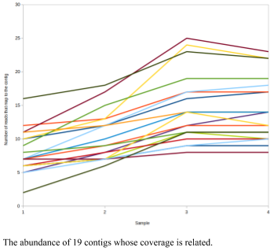

# Cross-Assembly and Binning

Over the last few years, sequencing has become cheap enough that most metagenomics projects are not a single sequencing run with a lot of data analysis. Most projects involve multiple samples separated either temporally or spatially, and then the data is combined in the analysis. There are lots of advantages of doing this: you can recover more information than just the sum of the number of sequences that you have run. In particular, you can uncover information about the unknown sequences &ndash; things that do not map to other sequences using traditional functional based approaches.

In the course we are going to work through binning a set of metagenomes. The samples that we have provided (algae, coral, cca, and control) come from four different samples, and the different reads within each sample come from different time points. Therefore, we can try and use binning to explore the data in our metagenomes. Much of this tutorial came from [Prof. Bas Dutilh](http://tbb.bio.uu.nl/dutilh/) at the University of Utrecht, and specifically his [CABBIO course](http://tbb.bio.uu.nl/dutilh/courses/CABBIO/)

There are a couple of different approaches to binning contigs that have been developed. The general theory is that assembly does not provide complete coverage of a genome, especially when genomes are assembled from metagenomes. Therefore, we need an approach to identify which contigs are related to each other – which contigs come from the same organisms. Some approaches use *k*-mer profiles to identify reads or contigs that appear to come from the same organism, and group those. We routinely use the abundance of each contig in each sample as a measure for the similarity between contigs. Therefore, the approach we are going to take involves creating a cross assembly of all the reads, assembling those, and then mapping the reads back to the cross-assembled contigs. This allows us to identify how many reads from each sample map to each contig, providing a measure for each contig. We can use that information to pull out related contigs, and test whether they are from the same or similar organism.

## Manual Binning

### I. Renumbering the reads [optional]

Before we begin making contigs, we are going to renumber the reads. This will allow us to quickly identify which reads come from which samples when we remap things backwards. In addition, some programs are persnickety about the names they allow for DNA sequences, and so this takes care of that.

There is a program called [renumber.py](https://raw.githubusercontent.com/linsalrob/EdwardsLab/master/bin/renumber_fasta.py) that is in the AWS images.

The command takes an input fasta file, a file name to output the renumbered sequences to, and an optional number to start at denoted by the `-n` flag. We start at 1, and then renumber the sequences consecutively. Note that the number we apply to `renumber.py` is one more than the number printed out from the previous run of the command!

*Don’t forget to change the names of your files to match the samples you are analyzing!*

```bash
renumber_fasta.py -f Algae_11.fna -o Algae_11.renum.fna
The last ID written to the file Algae_11.renum.fna was 514323

renumber_fasta.py -f Algae_12.fna -o Algae_12.renum.fna -n 514324
The last ID written to the file Algae_12.renum.fna was 1514534

renumber_fasta.py -f Algae_13.fna -o Algae_13.renum.fna -n 1514535
The last ID written to the file Algae_13.renum.fna was 2800777

renumber_fasta.py -f Algae_14.fna -o Algae_14.renum.fna -n 2800778
The last ID written to the file Algae_14.renum.fna was 4262674
```

*Note:* It is never a good idea to provide the same name for input and output. Usually you will end up overwriting your file and loosing all your data. This is a bad habit to get into: it is much better to make a new file (like we have done here), and once you are happy, delete the old file.

#### Creating smaller data sets

It is possible that the spades assembly step in the next section will not work. However, we have given you a lot of data.

*Thought experiment*: How can you count the number of reads in all the fasta files with one command?

Therefore, `renumber.py` takes an additional argument, `-x`, that limits the maximum number of sequences it will write to any file. If you want to limit the data input to the spades assembly in the next step, try adding a `-x`, like these four commands. Again, you don’t need the $ and you should change your file names as appropriate. (The `-n` sets the number to start counting at).

```
renumber_fasta.py -f Algae_11.fna -o Algae_11.renum.fna -x 10000 -n 1
renumber_fasta.py -f Algae_12.fna -o Algae_12.renum.fna -x 10000 -n 10001
renumber_fasta.py -f Algae_13.fna -o Algae_13.renum.fna -x 10000 -n 20001
renumber_fasta.py -f Algae_14.fna -o Algae_14.renum.fna -x 10000 -n 30001
```

We end up with four new files with the sequences numbered consecutively, and so we can concatenate those into a single file that we will assemble.

```bash
cat Algae_1?.renum.fna > AlgaeAllReads.fasta
```

### II. Assembling the metagenomes
There are many different algorithms for assembling sequence data, but there are a couple of common approaches. One way is to compare every read to every other read (or nearly every other read) and try and figure out what the best assembly is. Another approach is to use short sequences, called k-mers (which we will see elsewhere) and identify potentially overlapping fragments. 
We are going to use the spades assembler (57) (http://bioinf.spbau.ru/spades) to assemble the files. Spades is one of the best assemblers out there, and is frequently updated with new versions. The version we have is version 3.9 and supports metagenome assembly, however metagenome assemblies require a single paired-end library and does not work with unpaired data like we have here.

If we have Ion Torrent data, we would use an assembly commad like this:

```bash
spades.py --iontorrent -s <Reads file .fasta> --only-assembler -o <output directory for the results>
```

 and so we’ll use the command:

```bash
spades.py --iontorrent -s AlgaeAllReads.fasta --only-assembler -o AlgaeAssembly
```

This will create the `AlgaeAssembly` directory and in that directory there will be a single fasta file called `contigs.fasta` with the contigs in it (*Note*: as an alternative you can use the `scaffolds.fasta` file too). We will use that file in the next steps, but before we continue we’d like to know a little bit about the assembly. 

### III. Assembling multiple reads from metagenomes

*Thought experiment*: Before you begin, think about where you are going to work. Should you make a new directory? Should you do this in your home directory? Why/Why not?


If we have lots of Illumina samples, we would start by combining the reads into three files: the left reads, the right reads, and the singleton reads – the singleton reads are left reads that don’t have a right mate or right reads that don’t have a left mate.
We start by concatenating all the sequences:

If the sequences are not compressed you can use:

```bash
cat /data/gut/fastq/*_1.fastq > left.fastq
cat /data/gut/fastq/*_2.fastq > right.fastq
```

If your sequences are compressed you can use:

```bash
gunzip -c  /data/ground_water/fastq/*_1.fastq.gz > left.fastq
gunzip -c  /data/ground_water/fastq/*_2.fastq.gz > right.fastq
```

Next, we can use spades to try to assemble these:

```bash
spades.py --meta -1 left.fastq -2 right.fastq -o assembly
```

You should see an error like this:

```
Verification of expression 'irsl.eof() && irsr.eof()' failed in function 'void hammer::CorrectPairedReadFiles(const KMerData&, size_t&, size_t&, size_t&, size_t&, const string&, const string&, std::ofstream*, std::ofstream*, std::ofstream*, std::ofstream*, std::ofstream*)'. In file '/spades/src/projects/hammer/hammer_tools.cpp' on line 188. Message 'Pair of read files /home/ec2-user/gut_assembly/left.fastq and /home/ec2-user/gut_assembly/right.fastq contain unequal amount of reads'.
```

If you read that error, the key message is: *left.fastq and right.fastq contain unequal amount of reads*. What this means is that the command to `spades.py` suggests these are paired end reads, and yet there are sequences in one file that are not in the other file.

We need to correct the files to make sure that you have the same number of sequences in the left and right reads, and that the sequences are in the same order in each file. We have struggled over this but now have a fast solution that works with big files:

We can use [fastq-pair][https://github.com/linsalrob/fastq-pair)  for that:

```
fastq_pair left.fastq right.fastq
```

This command prints out a summary of the left reads and the right reads:

```
Left paired: 45679              Right paired: 45679
Left single: 476                Right single: 361
```

Now we can rerun spades:

```bash
spades.py --meta -1 left.fastq.paired.fq -2 right.fastq.paired.fq -o assembly
```

Note that meta spades (spades with the `--meta` flag) currently requires just one left and one right paired end file. Regular spades (not using the `--meta` flag) allows you to provide one or more left and right pairs, and singleton reads to assemble.

Your milage may vary depending which version of spades you try to run.

### IV. Mapping reads to contigs with bowtie
We need to know which samples contributed reads to each contigs so that we can count the coverage of each contig and identify which contigs are likely related to each other. To do so, we will use [bowtie-2](http://bowtie-bio.sourceforge.net/bowtie2/index.shtml), which is a really fast way to map reads to sequences.

First, we need to build an index of our contigs file (as usual, make sure you change the filename!):

```bash
bowtie2-build AlgaeAssembly/contigs.fasta AlgaeBowtie
```

Next we map all the reads to the contigs. We use our `AlgaeAllReads.fasta` file that we created before, and which has the renumbered reads:

```bash
bowtie2 -f  -x AlgaeBowtie -U AlgaeAllReads.fasta > AlgaeAllReads.cross-assembly.bowtie2.sam
```

The options we include are:
`-f` : the input file is in fasta format only 
`-x` : the index file we made in the previous step 
`-U` : we are using unpaired reads

There are several options that you can include, and if you are running on a machine with more than one core you should add `-p` to increase the number of threads that `bowtie-2` will use. Use `bowtie -h` to see more information.

When `bowtie-2` is complete it will show you some output about the data, for example:

```
200000 reads; of these:
  200000 (100.00%) were unpaired; of these:
    120140 (60.07%) aligned 0 times
    79390 (39.70%) aligned exactly 1 time
    470 (0.23%) aligned >1 times
39.93% overall alignment rate
```

This shows that about 40% of my raw reads ended up in contigs.

`bowtie-2` makes a file called a `SAM` file (for Sequence alignment and mapping format) which contains detailed information about the reads and how they map to the reference database (in this case, the contigs we made in contigs.fasta). 

### IV. Using crAss to identify cross-assembled contigs.

The program [crAss](https://edwards.sdsu.edu/crass/) allows us to read the `sam` file created by `bowtie-2` and make some diagrams that explain the data. `crAss` needs a single directory as input and expects to find the fasta files and the sam file there. It will automatically figure out which is which.

First, we make a new directory, called `crAss`, and move the data there. Here, we are just copying the renumbered `fasta` files (not the originals) and the `sam` file that was the last argument in the `bowtie` command above. Don’t forget to change the name of your data sets!

```bash
mkdir crAss
cp Algae_1?.renum.fasta  AlgaeAllReads.cross-assembly.bowtie2.sam crAss
```

now that we are set, we can run `crAss`:

```bash
crAss.pl crAss/
```

There are several output files in the `crAss` directory, and they are largely named on the method used to determine the relationship between contigs (there are several ways of calculating the distance between contigs). However, we are going to use the file `output.contigs2reads.txt` which has a table of the reads and the contigs that they map to.

First, open that file in a spreadsheet program. I use open office, and it is installed on the virtual images, or you can copy it to your computer and use sheets, excel, or anything else.

Sort the data by the first column, second column, third column, etc, and then look at the data and see if there are “groups” of data. For example with the algae data I think there is a group of data centered with about 25x coverage of the contigs. 

I plotted a line plot of those contigs, and you can see that some of the contigs have the same coverage trend. This suggests that these contigs are really part of the same bin!

We could manually identify each of the contigs that group together, or we can use Pearson correlations to identify the related contigs. There are two ways that you can do this. In Excel or Open Office you can calculate the correlation between a single abundant contig and all of the other contigs using the `correl` function. 

The alternative is to use a small program that I wrote, `crAss_contig_correlations.py` will parse the `output.contigs2reads.txt` file and calculate pairwise Pearson correlations for all pairs of contigs in that data. 

```bash
crAss_contig_correlations.py -d crAss/output.contigs2reads.txt > pearson.txt
```

This code takes several different options that can be used to limit the output for `crAss_contig_correlations.py`. As always, use the `-h` flag to get some helpful information:

```bash
$ crAss_contig_correlations.py -h
usage: crAss_contig_correlations.py [-h] -d D [-s S] [-r R] [-m M]

calculate pairwise pearson correlations between contigs and then cluster them

optional arguments:
	-h, --help  show this help message and exit
	-d D        data table with contigs in rows and occurence in columns
	-s S        minimum number of non-zero samples (default=all samples)
	-r R        minimum number of reads (row total) for a sample to be included  (default=all rows)
	-m M        minimum Pearson correlation to be printed out
```


For example, one of the problems we may run into is that if there are a few reads that map, we get a strong correlation, but it is not meaningful. Therefore, we can restrict the correlation to both the number of non-zero values (if everything was 0, the correlation score would be 1!) and also to a minimum number of reads in total (the row total for the table). In this example, I restrict my analysis to just those contigs that are present with 30 or more reads in all the samples using the `-r` option:

```bash
crAss_contig_correlations.py -r 30 -d crAss/output.contigs2reads.txt > pearson.txt
```

*Thought experiment*: What does it mean if the read abundance of two contigs is perfectly anticorrelated with each other (i.e. pairwise score is -1).

*Thought experiment*: The simplest explanation for different contigs having similar read coverage in different samples is that they came from the same metagenome. Can you come up with any other explanations for why this could also be true?

Another problem that we will run into is that we are only interested in the  contigs that are highly correlated with each other (i.e. the pairwise correlation coefficient is large). This would allow us to find some interesting high correlations.

We can limit the output with the `-m` option, to just print out the pairs of contigs whose read correlation is above 0.95:

```bash
crAss_contig_correlations.py -r 30 -m 0.95 -d crAss/output.contigs2reads.txt > pearson.txt
```

#### Running crAss on guts and groundwater

Before we start we need to make a bowtie index:

```bash
bowtie2-build assembly/contigs.fasta GutBowtie
```

First, we are going to map the reads to contigs:

```bash
bowtie2 -x GutBowtie -1 left.fastq -2 right.fastq > gut.bowtie2.sam
```

This will give you an error. *Why?* Recall that you can fix it using `fastq-pair` as described above.

```bash
bowtie2 -x GutBowtie -1 left.fastq.paired.fq -2 right.fastq.paired.fq > gut.bowtie2.sam
```

Now we are going to make a directory to run `crAss` in:

```bash
mkdir crAss
cp gut.bowtie2.sam crAss/
cd crAss
```

`crAss` needs `fasta` files but we only have `fastq` files, so lets convert `fastq` to `fasta`:

First, lets get some file names.

```bash
for FILE in $(ls /data/gut/fastq/*fastq); do OUTPUT=$(echo $FILE | sed -e 's/^.*\///; s/fastq/fasta/'); echo $FILE $OUTPUT; done
```

Then we can use those file names to extract the fasta files. *Make sure you are in the crAss directory before you do this.*

```bash
for FILE in $(ls /data/gut/fastq/*fastq); do OUTPUT=$(echo $FILE | sed -e 's/^.*\///; s/fastq/fasta/'); echo $FILE $OUTPUT; fastq2fasta $FILE $OUTPUT; done
```
Finally, we move back and run crAss:

```bash
cd ..
crAss.pl crAss/
```
 
And then we can look for correlations:

```bash
crAss_contig_correlations.py -d crAss/output.contigs2reads.txt -s 1 > pearson.txt
```

*Note:* `crAss_contig_correlations.py` has two parameters, `-r` and `-s` that adjust the sensitivity of the output. `-r` limits the outputs based on the row sums. If you have lots of data, you can increase `-r` and only print out those contigs that are highly prevalent. `-s` limits the amount of zero's in your datasets. The problem is that zero doesn't mean anything and yet it correlates highly! For example, if you have data like this:

Contig | Metagenome 1 | Metagenome 2 | Metagenome 3
--- | --- | --- | ---
Contig 1 | 0 |  0 | 0
Contig 2 | 0 |  0 | 0
Contig 3 | 0 |  0 | 0

They will all be highly correlated!

You can use the `-s` flag to filter some of these out

### V. Using linux commands to find related contigs

We can explore those a little more using some of the linux commands we have learned above.

I’d first like to know, out of the pairs of contigs that have >0.95 correlation, which contigs appear frequently. The code to list the Pearson correlations only prints out the correlation coefficient in one direction (e.g. when calculating the coefficient between x and y, it only prints out x vs y, not y vs x). The score in the other direction will be the same. Therefore, we need to look at both the first two columns and see how frequently each contig name appears.

See if you can figure out how this command works:

```bash
cut -f 1,2 --output-delimiter=$'\n' pearson.txt  | sort | uniq -c | sort -n
```

The `-f 1,2` option to cut means print out the first two fields that match. We haven’t talked about this weird output-delimiter notation, but basically it means print a new line between each entry.

When I run this, I find a contig (called `NODE_323_length_2368_cov_1.94207`)  that is highly correlated to 18 other contigs. 

When you run it, you might get a contig that is most correlated to 100,000 other contigs. Don't use that! Choose one that is correlated to about 15 or so contigs so that you don't get overwhelmed.

To find out what those contigs are, we can use a combination of `grep` and `cut` (don’t forget to change the `NODE_323_length_2368_cov_1.94207` and the `pearson.txt` parts of this command!)

```bash
grep NODE_323_length_2368_cov_1.94207 pearson.txt | cut -f 1,2 --output-delimiter=$'\n' | sort -u
```

This will print all 19 contigs (the contig I am looking for and the other 18 contigs). 

We can use this list to find their abundance profiles in the different samples from the `output.contigs2reads.txt` file created by crAss:

```bash
grep NODE_323_length_2368_cov_1.94207 pearson.txt | cut -f 1,2 --output-delimiter=$'\n' | sort -u | xargs -n 1 -I % grep % crAss/output.contigs2reads.txt
```

Here we use the `xargs` command, and tell it that we want one argument per command (`-n 1`), and that we want to insert (`-I`) the argument at the position marked by the `%`. Thus xargs runs the grep for each argument on the file `output.contigs2reads.tsv`.


I can redirect the output of this file to a new file:

```bash
grep NODE_323_length_2368_cov_1.94207 pearson.txt | cut -f 1,2 --output-delimiter=$'\n' | sort -u | xargs -n 1 -I % grep % crAss/output.contigs2reads.txt > node_323.tsv
```

Now that I have a list of the interesting contigs, I can plot a graph of their abundance across the different samples.




We could explore this data set further by asking whether it is appropriate that all of these contigs be binned together. For example, if we blast them against a non-redundant database (e.g. at NCBI), do all the contigs match a similar organism?

We could extract just the reads that contributed to these contigs and reassemble them to see whether we get better assemblies without all the other reads in the mix causing us problems.

To do this, you need to first get a list of just the contig IDs:

```bash
cut -f 1 node_323.tsv > ids.txt
```

and use those to extract the contigs from the `contigs.fasta` file that you created with `spades`. For example, you [can use this code](https://edwards.sdsu.edu/research/perl-one-liner-to-extract-sequences-by-their-identifer-from-a-fasta-file/) or you can do it via [seqtk](https://www.biostars.org/p/45356/). 

Those sequences represent a set of contigs that are correlated across your metagenomes &ndash; *i.e.* the most likely explanation is that they come from the same genome! This is a metagenome assembled genome, and you can check the completeness with [checkM](../CheckM/). 


