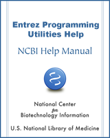

# Using NCBI edirect to access data at NCBI

NCBI has developed the [edirect](https://www.ncbi.nlm.nih.gov/books/NBK179288/) command line application for interfacing with their system. We can use that to query NCBI from the command line.

[](https://www.ncbi.nlm.nih.gov/books/NBK179288/)For many of these examples, check out the  [EDirect Cookbook](https://github.com/NCBI-Hackathons/EDirectCookbook) and the [NCBI EDirect book](https://www.ncbi.nlm.nih.gov/books/NBK179288/)

For all of the `eutils`, you can add the option `-help` to the command to get more information about that command. For example, `efetch -help` will give you lots of information about the `efetch` command.

For each of these commands you need to tell NCBI what your email address is. The AWS instances have a generic address of `ec2-user@ip-xxx-xxx-xxx-xxx.us-east-2.compute.internal` but obviously that is not meaningful. NCBI requires an email address so they can contact you if you write a script that goes off the rails and starts DOS attacking them (also, as I know from personal experience, they will simply block your IP so you can no longer access their services!)

## NCBI Databases

Before we start, we need to know which databases are available. You can find a list of databases using `einfo`:

```
einfo -email xxx@sdsu.edu -dbs | sort
```
*Note: you need to specify your email address here!*

|    |   |    |   |
--- | --- | --- | --- |
annotinfo | gapplus | nlmcatalog | probe
assembly | gds | nuccore | protein
biocollections | gencoll | nucest | proteinclusters
bioproject | gene | nucgss | pubmed
biosample | genome | nucleotide | pubmedhealth
biosystems | geoprofiles | omim | seqannot
blastdbinfo | grasp | orgtrack | snp
books | gtr | pcassay | sparcle
cdd | homologene | pccompound | sra
clinvar | medgen | pcsubstance | structure
clone | mesh | pmc | taxonomy
dbvar | ncbisearch | popset | unigene
gap   | | | |

We can find out more about any of these databases using the einfo command again:

```
einfo -email xxx@sdsu.edu -db assembly | less
```

However, this prints out XML, which is not very readable. Instead, eutils from NCBI comes with a program called xtract that converts XML into text. We can use that to extract the name and description associated with the fields in a database:

```
einfo -email xxx@sdsu.edu -db assembly -fields 
```

or

```
einfo -email xxx@sdsu.edu -db assembly | xtract -pattern Field -element Name Description
```


