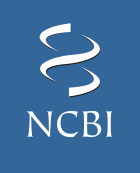
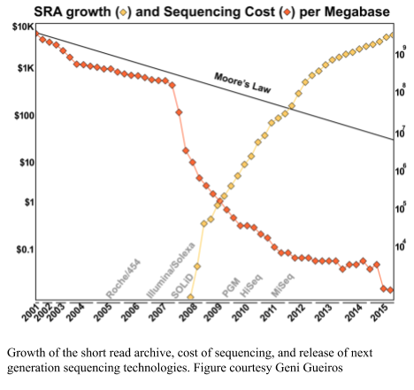
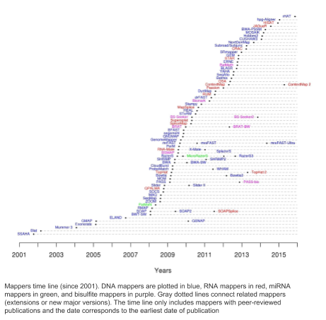

# DNA and Protein Databases

*Thought experiment*: What was the first protein sequenced, how long was it, and when was it sequenced?[1](#footnote1). 

 At the advent of DNA sequencing, in the 1980’s, there were no databases, but there were also very few scientific journals. As people started generating sequences, a few researchers petitioned the editors of the scientific journals to create a standard: prior to publishing the sequence of a piece of DNA, the authors must deposit the sequence in a publicly available database. This ensured that all the sequences that had been generated were available for other scientists to use. 

 The first three databases became the National Center for Biotechnology Information ([NCBI](https://www.ncbi.nlm.nih.gov/), the DNA Database of Japan ([DDBJ](https://www.ddbj.nig.ac.jp/index-e.html)), and the European Bioinformatics Institute ([EBI](https://www.ebi.ac.uk/)). To ensure rapid access of all sequences to all researchers, these three databases agreed to share their DNA sequences nightly. You can submit a DNA sequence to any of these three databases, and it will appear in the other two when they synchronize.

 One of the problems with this approach, however, was that different research groups sequenced the same thing. In the early days of DNA sequencing competing scientists working on the same gene would sequence it; sometimes people sequenced the same organism; and of course, you will find the same protein in different organisms. To overcome this redundancy in the data, the sequence databases introduced the concept of “**non-redundant**” databases. These databases only have one version of each sequence, and from that version you can access the different sources of the sequence. NCBI made two different non-redundant databases, one called **nr** for proteins, and one called **nt** for nucleotides.

Each of these databases has grown over the years. The NCBI now houses a lot more than DNA sequences &mdash; you can find a complete list of the resources available at NCNI, including assembly databases, Bookshelf with freely available text books, variant databases associated with human diseases, transcriptional profiling databases, pubmed - the complete list of abstracts to scientific papers, pubchem - a chemistry database of compounds, a taxonomy database, and much more at the [NCBI Resources Page](https://www.ncbi.nlm.nih.gov/guide/all/).

The Protein DataBank was started in 1971 with 10 sequences and by 1976 it had grown to 23 structures. Structures in the PDB continue to grow not only in number, but in complexity. The crystal structures include actin and myosin, the complete ribosome, and even membrane complexes like the photosystem. Similar in organization to the nucleotide databases, the PDB has an American component, [RCSB](http://www.rcsb.org), the Research Collaboratory for Structural Bioinformatics, a European component [PDBe](https://www.ebi.ac.uk/pdbe/) under the auspices of EBI, and a Japanese component [PDBj](https://pdbj.org) lead largely out of Osaka University. In addition, there is a separate database, the [Biological Magnetic Resonance Data Bank](http://www.bmrb.wisc.edu) from the University of Wisconsin that acts as a central repository for NMR spectroscopy data.

## Annotation Databases

 As genome sequencing grew in popularity, several parallel efforts were started to organize the genomic information. One of the first efforts was **Swiss-Prot**, started in 1986 by Amos Bairoch. A similar effort, the **Protein Information Resource** was started by Margaret Dayhoff (who invented PAM matrices for protein alignment), and after her death was run by Cathy Wu. Swiss-Prot and PIR joined forces in 2003 to form **UniProt**. The **KEGG** (Kyoto Encyclopedia of Genes and Genomes; http://www.genome.jp/kegg/) effort was started in 1995 as a spin off from the Japanese human genome effort. Each of these resources has different takes and views on the same data, so when you are interrogating a sequence it is usually wise to view all the resources to see how they have interpreted it.

The Department of Energy’s [Joint Genome Institute](http://jgi.doe.gov/) (**JGI**) initially focused on sequencing the human genome, but also moved into plant and microbial sequencing. They required a database to house the genome sequences they were producing, and started the [Integrated Microbial Genomes](https://img.jgi.doe.gov/) (IMG) effort to curate the genomes they were sequencing. 

NCBI developed [RefSeq](https://www.ncbi.nlm.nih.gov/refseq/), a "comprehensive, integrated, non-redundant, well-annotated set of sequences, including genomic DNA, transcripts, and proteins.". The idea behind RefSeq was to have a *reference* sequence for organisms. For example, rather than having hundreds or thousands of *E. coli* genomes, we would have one that was well annotated. RefSeq has subsequently reannotated every genome through its Eukaryotic and Prokaryotic Genome Annotation Pipelines, and then those genomes are manually curated. [RefSeq](https://www.ncbi.nlm.nih.gov/refseq/) is distinct from [GenBank](https://www.ncbi.nlm.nih.gov/genbank/) because RefSeq is annotated by people at NCBI and is a curated subset of GenBank, while GenBank is the original submissions that were submitted by the people who generated the data. Thus GenBank is the archival record.

The **SEED** group grew out of work that started with Carl Woese, Ross Overbeek, and Gary Olsen sequencing and annotating archaeal genomes ([Bult et al., 1996](https://www.ncbi.nlm.nih.gov/pubmed/8688087); [Klenk et al., 1997](https://www.ncbi.nlm.nih.gov/pubmed/9389475)), and after several iterations through WIT (What is there?) and ERGO (Overbeek et al., 2003), the Fellowship for the Interpretation of Genomes (FIG) started first the SEED, and later the SAPLING databases (Overbeek, Disz & Stevens, 2004; Overbeek et al., 2005). 

The major problem that these groups were trying to tackle was that because all of the sequencing and annotation was done by different groups, each group used its own nomenclature for the same thing. For example, the genes involved in regulation of nitrogen fixation were called glnL and glnG by some groups (because they regulated glutamine synthetase) and ntrB and ntrC by other groups (because they regulated nitrogen utilization) (Merrick & Edwards, 1995). One approach to normalize these annotations is to group all the related proteins into a bin, and then give that bin a consistent name. The bins are sometimes called orthologous groups (e.g. KO from KEGG; COG from NCBI), sometimes they are called families (e.g. TIGRfam from the (now defunct) The Institute for Genomic Research (TIGR); FIGfam from FIG), etc. 

The Protein Families database [PFAM](https://pfam.xfam.org) has built closely related sets of proteins, and specifically implemented an algorithm that uses [Hidden Markov Models](http://hmmer.org) (HMMs) to search the database. 

### SEED Subsystems

The SEED also launched its genome re-annotation project, which was unique at the time. Very few groups were trying to annotate existing genomes, they were largely focused on new genomes being produced. However, the argument from the Fellowship for the Interpretation of Genomes was that you needed to correctly annotate the existing genomes so you could accurately annotate the new genomes. In addition, rather than asking someone to be an expert on the whole genome, the SEED approach relied on asking experts to review a small piece of metabolism – just a few genes that are involved in a single pathway, or a few genes that make a cellular structure. By building these subsystems, groups of genes that work together, the SEED engineers could map correctly annotated genes across new genomes. The SEED effort began with a few interested scientists, and has grown to over 1,500 subsytems in 30 level 1 classifications and 272 level 1+2 classifications (see above for a discussion of those classifications). 

## Searching Databases

*Thought experiment*: Are you going to use the same type of search for a protein sequence as for finding an abstract to a paper? What about a protein sequence versus a protein structure?

Each database has its own query system depending on exactly what you are trying to find. As we shall see, [NCBI](http://www.ncbi.nlm.nih.gov/) has an extensive search system called [Enterez](https://www.ncbi.nlm.nih.gov/search/) which gives you text search of a *lot* of independent databases such as [genomes](https://www.ncbi.nlm.nih.gov/genome/), [nucleotides](https://www.ncbi.nlm.nih.gov/nuccore/), [proteins](https://www.ncbi.nlm.nih.gov/protein/), and literature (both papers via [pubmed](https://www.ncbi.nlm.nih.gov/pubmed/) and [books](https://www.ncbi.nlm.nih.gov/books/). However, NCBI also has a separate system for searching for *similar* DNA or protein sequences built around the [BLAST](https://www.ncbi.nlm.nih.gov/blast/) algorithm. You can learn more about [how BLAST works](https://www.youtube.com/watch?v=g0nSH17psDc).

In addition, when searching through proteins

## Growth of Databases

Sequencing keeps getting cheaper and more ubiquitous, and so the databases keep growing. As shown in the figure below, the DNA sequence databases keep growing in size. The doubling time of the national databases is approximately 10 months (Cochrane et al., 2013).

*Thought experiment*: If the database doubles every 10 months, and you analyze a metagenome against the database. When do you need to analyze it again?

The problem with changing databases, that is often overlooked, is that if you are comparing two sets of sequences to the databases, and you change the database between the comparisons, your results will be meaningless. For example, suppose you have two sets of sequencing data, one from an algae and one from a coral (as we will use below!). If you compare the algae sequences to the database in January, and the coral sequences to the database in November, the database will have doubled in size, and so you are twice as likely to find a match in November as you were in January.

The solution is to ensure that you always compare the sequences to the same database. Preferably, you should download a database, and keep track of the version of the database, and the date that you downloaded it. Then, compare all sets of sequences to that database. 

If you can’t download the database, the other solution is to load up all the sequences at the same time, and initiate the comparison. Even if it means reanalyzing sequences that you have already compared. The analysis software should keep track of that if the computation is expensive (some analytical pipelines do, some do not). 

## Which Database to Use?

With all these databases, which one should you use? It largely doesn’t matter, except for two caveats! **First**, you must use the same database for all your analysis. You can not switch between databases mid-analysis or else your results will not be comparable. In fact, you should download a database and use that version for everything! **Second**, some of the databases, notably the SEED and KEGG, have protein functions organized into categories that reduce the dimensionality of the data and aid in the downstream analyses. You should probably use one of those!

## Which Tools to Use?

In this manual we talk about a lot of different tools to analyze data. These are the tools that we are familiar with, they work, and we use them a lot. 

For any given task there are a lot of tools that could answer that problem. For example, one of the tools we use a lot is bowtie2 that maps DNA sequences to references or contigs. Here is a diagram of all the tools that do the same task that have been developed over the last few years (source: https://www.ebi.ac.uk/~nf/ hts_mappers/).

There are lots of other tools out there, and we recommend that you try them. People often ask how to know if they should use a tool. Here are our rules of thumb:

* Don’t use a tool if it takes more than 5 minutes to install!
* There are lots of ways to install software, and they all work. If the tool requires more than five minutes to install, you’re going to have a real headache and it probably won’t work anyway!
* Don’t use a tool if there is no test suite.
* If there is no test suite, how will you know if you installed it correctly? There should be a straightforward test that says it works or does not. 
* Avoid tools that require you to download all of NCBI. I already have NCBI downloaded. I try to avoid tools that require me to download it again to a specific location because it was convenient for the programmer. If the tool allows you to specify directories and locations of files you may be able to set it up using symbolic links.

## Other database tools

* [NCBI EDirect](NCBI_Edirect.md) for programmatic access to NCBI
* [NCBI SRA database](SRA.md) for the Sequence Read Archive

<a name="footnote1">1</a> Answer: The two chains of Bovine insulin were sequenced by Frederick Sanger for which he won the first of his two [Nobel prizes](https://assets.nobelprize.org/uploads/2018/06/sanger-lecture.pdf?_ga=2.252208394.240635431.1536540196-142663681.1536540196) (The other prize was for his work on [DNA sequencing](https://assets.nobelprize.org/uploads/2018/06/sanger-lecture-1.pdf?_ga=2.72584208.240635431.1536540196-142663681.1536540196)
