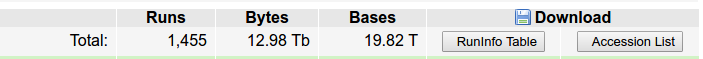
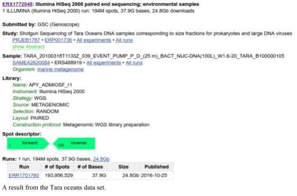
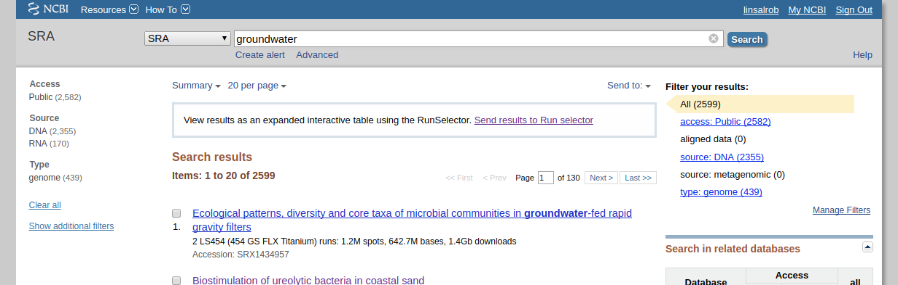
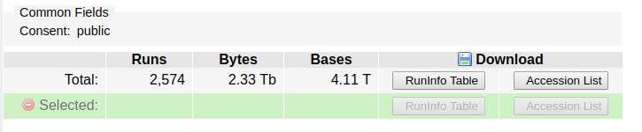

# The Sequence Read Archive (SRA)

The [sequence read archive](https://www.ncbi.nlm.nih.gov/sra/) (SRA) was started in ~2009 to handle the wealth of next generation sequencing data that was being deposited at NCBI. Many people needed a repository of data that was more flexible than the traditional [GenBank](https://www.ncbi.nlm.nih.gov/genbank/) archive. 

The SRA has [grown at an enormous rate](https://www.ncbi.nlm.nih.gov/sra/docs/sragrowth/), and now houses almost 20 Petabytes of data:


SRA houses raw data in binary files, and provides a tool kit to extract that data into `fastq` files.

 Nowadays, the Sequence Read Archive (SRA) stores raw sequence data from "next-generation" sequencing technologies including Illumina, 454, IonTorrent, Complete Genomics, PacBio and OxfordNanopore.
 
Data in the SRA is organized into a series of metadata tables:

Metadata | Description
--- | ---
Study (SRP) | A study is a set of experiments and has an overall goal.
Experiment (SRX) | An experiment is a consistent set of laboratory operations on input material with an expected result.
Sample (SRS) | An experiment targets one or more samples. Results are expressed in terms of individual samples or bundles of samples as defined by the experiment.
Run (SRR) | Results are called runs. Runs comprise the data gathered for a sample or sample bundle and refer to a defining experiment.
Submission | A submission is a package of metadata and/or data objects and a directive for what to do with those objects.

A Study (SRP) has one or more samples; a sample (SRS) has one or more experiments (SRX); an experiment has one or more runs (SRR).

*Note*: The runs are where the actual DNA sequences reside and are what you want to download from NCBI.

The SRA also provides a mechanism to sort through the data tables to find the specific data that you are looking for. For example, to download the data from the Tara oceans (*warning*: this is a **lot** of data), you would search the SRA for [Tara Oceans](https://www.ncbi.nlm.nih.gov/sra/?term=Tara+Oceans) There are currently 1,455 experiments associated with the Tara oceans. If you click on one of those you can see the runs associated with that experiment. You can download individual runs from the SRA and process them.

If you want to select multiple runs from that search, click on the "send to Run Selector" link in the SRA search results archive. This will show you that the SRA data is quite big: 



I told you it was quite a lot of data!

We can also search for other data sets. For example, to find all the USA human microbiome data sets, we can search for HMP. There are 18,405 experiments associated with the HMP in the SRA database!

## SRA factsheet

A lot more information about the SRA web interface is given in the [SRA fact sheet](https://www.ncbi.nlm.nih.gov/core/assets/sra/files/Factsheet_SRA.pdf)

## Other ways to search SRA 

As an alternative to searching through the website, we can also access the data in other ways.

The [SRAdb bioconductor R package](https://bioconductor.org/packages/release/bioc/html/SRAdb.html) integrates the ability to download an SQLlite database of the SRA metadata that was created by the [Meltzer Lab](https://ccr.cancer.gov/Genetics-Branch/paul-s-meltzer) (where you can also [explore the SRA metadata](https://gbnci-abcc.ncifcrf.gov/sra/)). However, we don't use R that often, but we can still take advantage of their hard work (thank you!!!). Their [GitHub site](https://github.com/seandavi/SRAdb) includes direct links to both the [SQLite](https://starbuck1.s3.amazonaws.com/sradb/SRAmetadb.sqlite.gz) and [MySQL](https://starbuck1.s3.amazonaws.com/sradb/SRAdb.mysqldump.gz) versions of their database. 


 The uncompressed file is ~23GB, *so you can not download it onto the Amazon Machine Image*, but this now allows you to perform complex queries on the SRA data.

Once you have downloaded the SQLlite database you can access it with your favorite programming tools. Almost all languages have an SQLlite connector, and there is also the stand alone program called [SQLlite](https://sqlite.org/download.html) that will allow you to search the data.

Before we begin searching, however, you need to understand the relationships between the tables first, and this is not clear from first principles! 

You can find a complete list of the attributes for each of the [tables in the SRA on our website](https://edwards.sdsu.edu/research/sra-attributes/).

We made a spreadsheet that has the first ~100 entries from the SRA metadata each for all the tables in the database. This shows you the column organization – each tab has the name of the SQL table that you will access – and each sheet has the entities for that table as the column headers. You can download the spreadsheet for [Microsoft Excel](https://edwards.sdsu.edu/research/wp-content/uploads/2015/12/SRAMetadataExample.xls) or [Libre Office](https://edwards.sdsu.edu/research/wp-content/uploads/2015/12/SRAMetadataExample.ods). 


## Finding metagenomes in the SRA

We are interested in finding metagenomes in the SRA, but they have a mixture of amplicon sequences and random community metagenomes. 

To solve this problem, we wrote the program [PARTIE](https://github.com/linsalrob/partie) ([Torres, Edwards & McNair, 2017](https://www.ncbi.nlm.nih.gov/pubmed/28369246)). We started by collecting all the potential metagenomes, including amplicon sequencing data sets, random metagenomes, and everything else that suggested it might be a  metagenome. Then we built a computer-based classifier using machine learning. We trained the machine learning algorithm about what is, and is not, a metagenome, by using a list where we had manually curated them. We measured how many unique *k*-mers there were (see the section on *k*-mers elsewhere), how many hits to a 16S library, hits to phages and viruses, hits to all bacteria. Uses these measures we can quickly and accurately determine whether something is a metagenome or not.

You can download the latest list of metagenomes from our [Git repository for this project](https://github.com/linsalrob/partie) and it is on your AWS images in `/usr/local/genome/partie`.

There is one key file that you should look at: [SRA_Metagenome_Types.txt](https://raw.githubusercontent.com/linsalrob/partie/master/SRA_Metagenome_Types.txt) has only two columns: the `SRA ID` and whether it is an ampicon or WGS or Other sequence.

Here is a way to search the SRA and limit it to just metagenomes:

First, search for what you are looking for on the SRA website. Lets search for groundwater samples:


Note that when I did this search there were 2,599 runs that mention groundwater, but *none* of them have "*source: metagenomic*" as shown on the right hand side.

Add those runs to the run selector, by clicking on the "*Send results to the run selector*" link in the box. Next, click to download the **accession list** in the link:



**Don't** download the data -- it is 4.11 terabytes!

Now, we can merge this list with the list of WGS metagenomes from PARTIE. Lets move that SRR_Acc_List.txt that you just downloaded onto your remote server using one of the [Data Transfer Methods](../Linux/).

Now we can use `grep`, `awk`, and other [unix](../Linux) commands to find things that are in one file, the other file, or what we want, which is both:

```
grep WGS /usr/local/genome/partie/SRA_Metagenome_Types.txt | cut -f 1 | cat - SRR_Acc_List.txt | sort | uniq -c | sort -nr | less
```

The first column is the number of times something appears. So things that being with "2" are in both the SRA_Metagenome_Types.txt file listed as WGS and in the ground water accession list.

We can take this even further and get just the IDs that we are interested in:

```
grep WGS /usr/local/genome/partie/SRA_Metagenome_Types.txt | cut -f 1 | cat - SRR_Acc_List.txt | sort | uniq -c | sort -nr | awk '/^[[:space:]]+2/ {print $2}'
```

These are datasets in the SRA that come from groundwater and are metagenomes, even though none of them are classified as metagenomes!

For example, here is one that I chose at random:

[Rifle groundwater metagenome and metatranscriptome following nitrate amendment Raw sequence reads](https://www.ncbi.nlm.nih.gov/sra/?term=SRR2177956) (In case you are curious, [Rifle](https://goo.gl/maps/uhf9GgvEmnR2)  is a place in Colorado)

## Example ways to retrieve SRA data

Here are some example SRA queries you can try using SQLite and the database you downloaded above:

1\. Retrieve all the run IDs associated with an SRA ID so you can download them (e.g. with prefetch or fastq-dump). Remember, that downloading requires runs, not submission accession numbers.

```
sqlite3 SRAmetadb.sqlite "select run_accession from run where submission_accession='SRA012183';"
```

2\. Count the study types in the database. This is a good one to see if the database loaded!

```
sqlite3 SRAmetadb.sqlite "select study_type, count(1) from study group by study_type;"
```

3\. Here is a count of all the amplicon sequencing projects:

```
sqlite3 SRAmetadb.sqlite "select study_type, count(1) from study where study_accession in (select study_accession from experiment where library_strategy = "AMPLICON") group by study_type;"
```

or the same query written a different way (I think the previous version is quicker, but try them and see):

```
sqlite3 SRAmetadb.sqlite "select study_type from study left join experiment on study.study_accession = experiment.study_accession where experiment.library_strategy = 'FL-cDNA';"
```

4\. Find all the run ids from all the metagenomics studies that are not from amplicon sequencing.

```
sqlite3 SRAmetadb.sqlite 'select run_accession from run where experiment_accession in (select experiment_accession from study left join experiment on study.study_accession = experiment.study_accession where experiment.library_strategy != "AMPLICON" and study_type = "Metagenomics");'
```

Or we can do the same thing a different way:

```
sqlite3 SRAmetadb.sqlite 'select run_accession from run where experiment_accession in (select experiment_accession from experiment where experiment.library_strategy != "AMPLICON" and experiment.study_accession in (select study_accession from study where study_type = "Metagenomics"));'
```

We can also test for all the metagenomes, not just amplicons:

```
sqlite3 SRAmetadb.sqlite 'select run_accession from run where experiment_accession in (select experiment_accession from experiment where experiment.study_accession in (select study_accession from study where study_type = "Metagenomics"));'
```

5\. Find all the metadata about an experiment associated with a run. This is multiple joins, and you can either do them one at a time, replacing the IDs as you go, or as a single large join:

One at a time:

```
sqlite3 SRAmetadb.sqlite "select experiment_accession from run where run_accession='ERR184835'; select sample_accession from experiment where experiment_accession='ERX160387'; select sample_attribute from sample where sample_accession='ERS183971';"
```

This is quick, but you need to paste the IDs each time (or write a script).

Using left joins:

```
sqlite3 SRAmetadb.sqlite "select sample_attribute from sample left join experiment on sample.sample_accession = experiment.sample_accession left join run on run.experiment_accession = experiment.experiment_accession where run_accession='ERR184835';"
```

Using subselects

```
sqlite3 SRAmetadb.sqlite "select sample_attribute from sample where sample_accession in (select sample_accession from experiment where experiment_accession in (select experiment_accession from run where run_accession='ERR184835'))"
```

I found that using SQLlite, the subselect approach is a lot faster than the left joins, especially because in these cases we are only looking for one (or a few) entries, but you should try them both and see which is faster.

6\. Get the accession number, study title, and study abstract associated with a run accession number

```
sqlite3 SRAmetadb.sqlite "select study.study_accession, study.study_title, study.study_abstract from study where study.study_accession in (select study_accession from experiment where experiment.experiment_accession in (select experiment_accession from run where run_accession = 'ERR187444'));"
```

This will give you information about why they did what they did (possibly!)

7\. Get all the run accessions from studies that have the words feces or fecal in the title or abstract. This is really a reorientation of the previous query:

```
sqlite3 SRAmetadb.sqlite "select run_accession from run where run.experiment_accession in (select experiment.experiment_accession from experiment where experiment.study_accession in (select study.study_accession from study where study.study_title like '%feces%' or study.study_title like '%fecal%' or study.study_abstract like '%feces%' or study.study_abstract like '%fecal%'))"
```

(Answer: as of Sept. 1st 2018 there were 113,952 runs from poo. That's a lot of poo sequencing!)

8\. List all the run accessions and the experiment libraries for those runs (e.g. amplicon, wgs, etc)

```
sqlite3 ~/SRA/SRA/SRAdb/SRAmetadb.sqlite "select run.run_accession, experiment.library_strategy from run left join experiment on run.experiment_accession = experiment.experiment_accession"
```

9\. Find all the runs from human microbiome studies. This includes reference genomes, 16S libraries, and WGS samples.

```
sqlite3 ~/SRA/SRA/SRAdb/SRAmetadb.sqlite "select run_accession from run where run.experiment_accession in (select experiment.experiment_accession from experiment where experiment.study_accession in (select study.study_accession from study where study.study_title like 'Human Microbiome Project%'))"
```

10\. Get all runs associated with a sample submission. We do this by joining via the experiment accession.

This is an approach using subselects:
```
sqlite3 SRAmetadb.sqlite "select run_accession from run where  experiment_accession in (select experiment_accession from experiment where sample_accession='SRS014689')"
```

Or you can do the same thing with joins:
```
sqlite3 SRAmetadb.sqlite "select run_accession from run left join experiment on run.experiment_accession=experiment.experiment_accession where experiment.sample_accession='SRS014689'"
```
The opposite of that command is:
```
sqlite3 SRAmetadb.sqlite "select sample_accession from experiment where experiment_accession in (select experiment_accession from run where run_accession='SRR062394')"
```

## Downloading data from the SRA 

To download sequences from the SRA, we need to use the [SRA toolkit](https://trace.ncbi.nlm.nih.gov/Traces/sra/sra.cgi?view=software)
 
You can download any SRR file (or ERR or DRR file) from the SRA in two different ways:

* `prefetch` will download the file but not process it.
* `fastq-dump` will download the file and extract the sequences

We typically just use `fastq-dump` to just extract 10,000 or 100,000 sequences from a file. That is enough to allow us to test whether the sample is a metagenome, a 16S dataset, a whole genome shotgun, or something else! Once we are satisfied, we either delete the SRA file or extract the whole thing to sequences for processing and analysis.

### fastq-dump

[NCBI's fastq-dump](https://ncbi.github.io/sra-tools/fastq-dump.html) has to be one of the worst-documented programs available online. The default parameters for `fastq-dump` are also ridiculous and certainly not what you want to use. Their documentation has absolutely required parameters mixed in with totally optional parameters, and so you have no idea what is required and what is optional. 

We have spent a long time working with `fastq-dump`, and our standard incantation for calling it is:

```
fastq-dump --outdir fastq --gzip --skip-technical  --readids --read-filter pass --dumpbase --split-3 --clip SRR_ID
```

You can find a lot more information about the [fastq-dump](https://edwards.sdsu.edu/research/fastq-dump/) parameters from our website (compare that one and the NCBI one...!)

*One word of warning about fastq-dump*: by default it creates a local cache of anything you download in `~/ncbi`. This is also a horrible idea as you can rapidly fill up your hard drive with copies of data that is in the SRA. If you notice your hard drive is full, be sure to delete `~/ncbi`!
