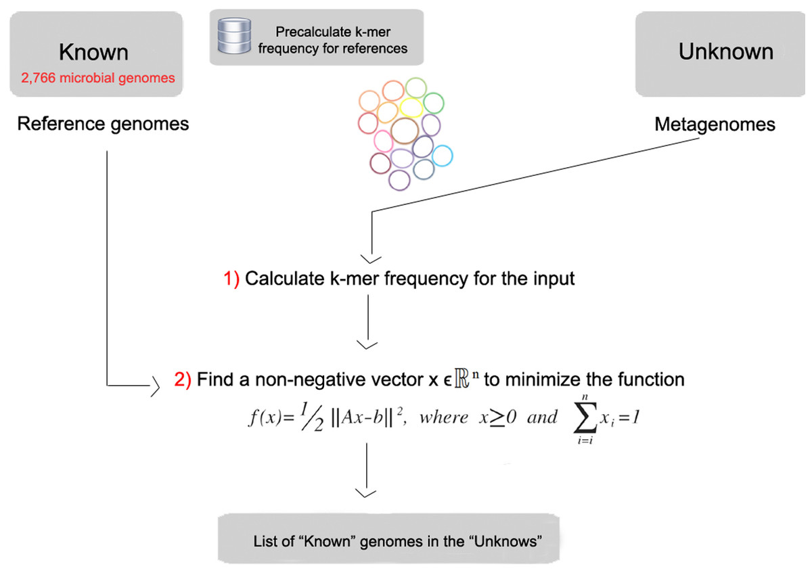

# Annotating the taxonomy of the bins with FOCUS

[Find Organisms by Compositional Usage (FOCUS)](https://edwards.sdsu.edu/FOCUS) ([Silva _et al._](https://www.ncbi.nlm.nih.gov/pubmed/24949242)) is a method that identifies the organisms present in a metagenomic sample. You can use FOCUS with any random metagenome (not a 16S dataset, though), and it will rapidly generate a list of the organisms that are present. FOCUS does not try and identify the source of each read, instead, it takes a holistic point of view, and uses the complete *k*-mer profile to analyze the metagenome. 

To learn more about focus, you should [read the paper](https://peerj.com/articles/425/) (it's free!).

[](https://dfzljdn9uc3pi.cloudfront.net/2014/425/1/fig-1-2x.jpg)
FOCUS starts by making a database of *k*-mers from a set of reference genomes. We use either reference genomes from [NCBI RefSeq](https://www.ncbi.nlm.nih.gov/refseq/) that has about 10,000 microbial genomes, or [PATRIC](https://www.patricbrc.org/) that has about 100,000 microbial genomes! It builds this database first so you don’t have to build the database each time you analyze data. Then, FOCUS reads your data and counts the *k*-mers present in your sample. It compares the counts that it generated from your sample to the counts from the reference database, and estimates the proportion of each organism in the database that, when combined, would give the proportion of *k*-mers in the sample. FOCUS generates that analysis in just a few seconds and allows us to rapidly annotate metagenomes.

We have installed focus.py on the virtual machine (but you will need version 7 or higher), and you can just run it by using the command 

```bash
focus -h
```

It takes a few command line arguments, and you can ask FOCUS to analyze a single metagenome or a collection of metagenomes. We are going to analyze our bins as a collection of metagenomes. This allows us to import the output from FOCUS into a statistical analysis tool, STAMP, and down some downstream processing. 

For example, to analyze a directory containing each of the bins, we use the command:

```bash
focus.py -q MetagenomeBins/ -o MetagenomeBinsAnnotations/
```

Alternatively, to analyze the [algae dataset](https://goo.gl/zvnZD4) you can download that data (using `curl`), extract the archive, unzip each of the `fastq` files, and then run

```bash
focus -q Algae -o Algae_Focus
```

You will get the following files, which provide the output at the different [taxonomic rank](https://en.wikipedia.org/wiki/Taxonomic_rank) of each file.

* output_All_levels.xls
* output_Kingdom_tabular.xls
* output_Phylum_tabular.xls
* output_Class_tabular.xls
* output_Order_tabular.xls
* output_Family_tabular.xls
* output_Genus_tabular.xls
* output_Species_tabular.xls
* output_Strain_tabular.xls


