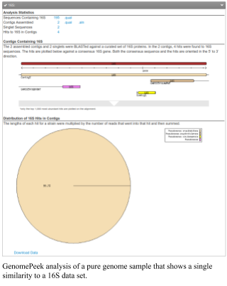
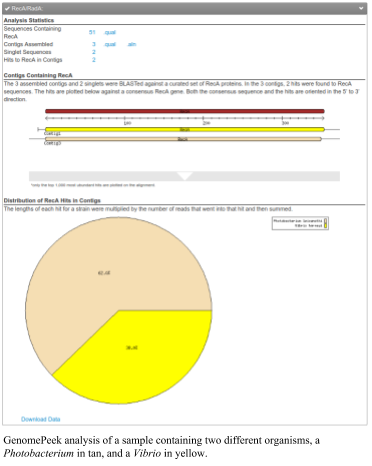
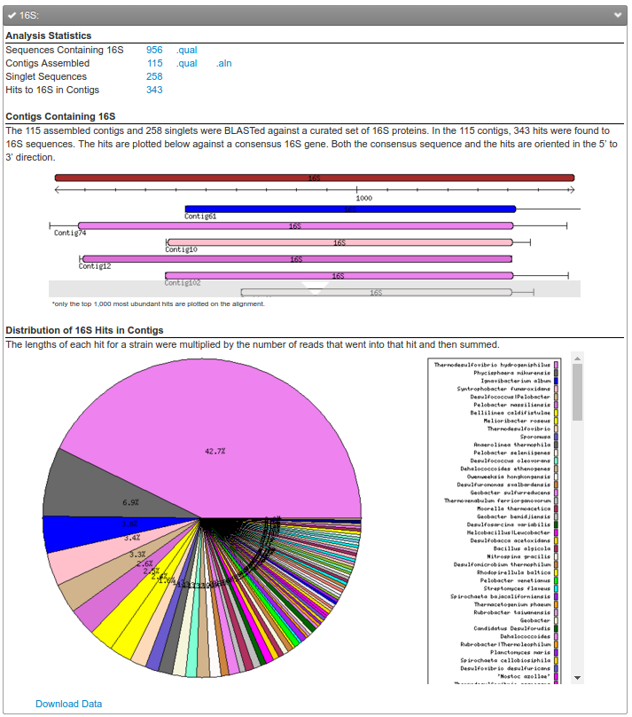

# Genome Peek

## Annotating the taxonomy of bins, metagenomes, and complexity of genomes with [GenomePeek](https://edwards.sdsu.edu/GenomePeek/)

Another way to identify the taxonomy of the organisms in the database is to identify a few key house-keeping proteins, and match those proteins in your metagenome bins. We developed the [GenomePeek](https://edwards.sdsu.edu/GenomePeek) GenomePeek software to take sequences, (e.g. contigs), and rapidly identify the presence of the 16S gene, _radA/recA_, _rpoB_, and _groEL_ ([McNair and Edwards](https://www.ncbi.nlm.nih.gov/pubmed/26157610)) in those sequences, and to identify the most likely species that are present in your sample. 

 If you have a pure genome, or a pure bin, you will see only a single organism present in the output. For example, the figure shows an analysis of a single genome sample that has a pure 16S gene and is a *Pseudomonas*. 

 

The second figure shows a mixed sample where there are only two organisms. In this case, there are a *Photobacterium* and a *Vibrio*. These species are closely related and we often isolate one when we isolate the other.

Finally, if you upload a metagenome, you’ll see a mixture of all of the organisms in your sample (see the third figure). In this figure, not only have we extracted all the 16S genes from this dataset, we tell you the proportion of each genus in the sample. This is probably the quickest way, but not necessarily the most correct way, to get an overview of your metagenome, whether it is from a 16S dataset or a regular metagenome!

Genome Peek provides a mechanism for you to download the sequences that match to each of the genes that we have identified, so you can easily pull out those sequences and view the alignments.

[GenomePeek](https://edwards.sdsu.edu/GenomePeek) provides a rapid way to identify the organisms in a metagenome bin, and to look at the completeness and contamination of the bins. All you need to do is go to the [GenomePeek upload page](https://edwards.sdsu.edu/GenomePeek/) and upload your contigs.fasta file. GenomePeek will complete the analysis for you!

