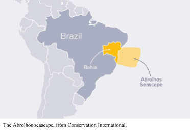

# Sample Metagenomes

We have several sample metagenomes that we provide for use in the course. However, please feel free to use your own metagenomes and data sets, and replace their filenames with the names we use throughout the course.

In the [Datasets](../Datasets) directory, we have collated several different projects:

## [Coral and Algae](../Datasets/coral_algae)

These sample data sets are from the Abrolhos region of Brazil, and are some low diversity metagenomes from an experiment where we tested the effects of Coral, Algae, CCA, or no treatment on the growth of microbes over time.

There are four groups of data:

* *Algae treatment* &mdash; 4 replicates (Algae_11, Algae_12, Algae_13, Algae_14)
* *CCA treatment* &mdash; 3 replicates (CCA_11, CCA_12, CCA_13)
* *Control treatment* &mdash; 4 replicates (Control_11, Control_12, Control_13, Control_14)
* *Coral treatment* &mdash; 4 replicates (Coral_11, Coral_12, Coral_13, Coral_14)

These samples were sequenced on an Ion Torrent, and so you will see quality differences and we’ll need to use the `--iontorrent` flag when assembling them using `spades.py`.

In many of the examples in this manual, I use the Algae samples to demonstrate the commands. Be sure to switch the `Algae_12.fna` name to the file name that you are working on.

[Read more about the coral and algae data sets](../Datasets/coral_algae/)

## [Drinking water](../Datasets/drinking_water)

The drinking water study is from the [University of Adelaide, Australia](https://www.adelaide.edu.au/), and they used 16S amplicon sequencing to explore microbes in the drinking water. The project is available at the NCBI as [SRP ID SRP059994](https://www.ncbi.nlm.nih.gov/Traces/study/?acc=SRP059994) 

The work is described in Shaw JLA, Monis P, Weyrich LS, Sawade E, Drikas M, Cooper AJ. 2015. Using Amplicon Sequencing To Characterize and Monitor Bacterial Diversity in Drinking Water Distribution Systems. [Appl Environ Microbiol 81:6463–6473](http://aem.asm.org/content/81/18/6463.long)

[Read more about the drinking water datasets](../Datasets/drinking_water/)

## [Ground Water](../Datasets/ground_water)

This random community metagenomics data set comes from SRA project [SRP075429](https://www.ncbi.nlm.nih.gov/Traces/study/?acc=SRP075429) where they looked at groundwater from Japan. 

The work was published in Hernsdorf AW, Amano Y, Miyakawa K, Ise K, Suzuki Y, Anantharaman K, Probst A, Burstein D, Thomas BC, Banfield JF. 2017. Potential for microbial H2 and metal transformations associated with novel bacteria and archaea in deep terrestrial subsurface sediments. [ISME J 11:1915–1929](https://www.nature.com/articles/ismej201739)

[Read more about the ground water datasets](../Datasets/ground_water/)

## [Gut](../Datasets/gut)

The gut random community data set is also from the Banfield lab, from SRA project [SRP074153](https://www.ncbi.nlm.nih.gov/Traces/study/?acc=SRP074153) where they looked at the infants in NICU and hospitals. 

The work was published in Brooks B, Olm MR, Firek BA, Baker R, Thomas BC, Morowitz MJ, Banfield JF. 2017. Strain-resolved analysis of hospital rooms and infants reveals overlap between the human and room microbiome. [Nat Commun 8:1814](https://www.nature.com/articles/s41467-017-02018-w)

[Read more about the gut datasets](../Datasets/gut/)

