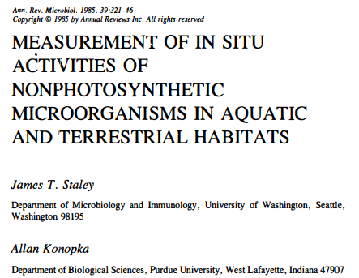
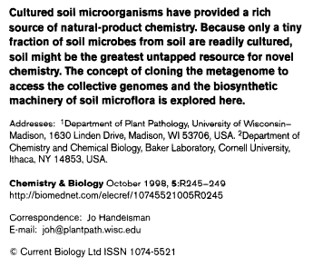
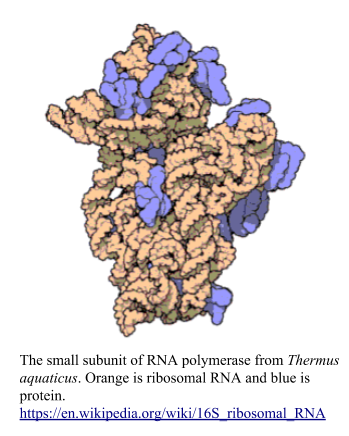
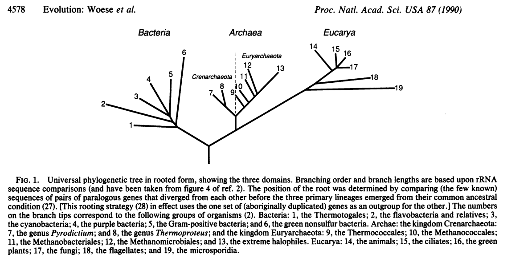
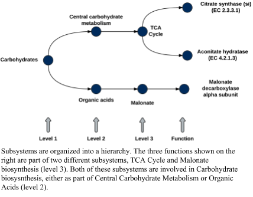
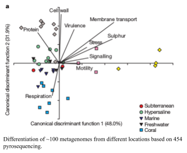

# Metagenomics introduction

In this course we are going to focus on microbial metagenomics, using DNA sequencing to understand microbes in different environments. Microbes don’t usually live alone – even the simplest environments we’ve studied have multiple microbes present (Tyson et al., 2004; Edwards et al., 2006; Rodriguez-Brito et al., 2010)

The *Great Plate Count Anomaly* is that not every microbe that we can detect &mdash; e.g. via direct staining &mdash; can be grown on petri dishes. This anomaly was first described in 1985, although observations describing this phenomena date back to 1932 from freshwater habitats and 1959 from marine environments (as reported in Staley and Konopka).

For example, Staley and Konopka present this data on the growth of bacteria in Lake Washington. The two panels represent the number of bacteria that were detected by staining with acridine orange, and the number of bacteria that were detected with plate counts. The *x*-axis is the month of sampling, and the *y*-axis is the depth in the lake.

More recently, the role of the microbiome or microbiota has become dominant in everything from human health and disease to agriculture to lifestyles. 

The concept of the microbiome or microbiota is not new – it has been around for at least 60 years. However, the application of cheap DNA sequencing to microbial environments has completely altered our understanding of the three fundamental questions that metagenomics addresses: What is in the environment, what are they doing, and how are they doing it.

The first flurry of papers about metagenomics emerged in the first years of the 21st Century (Breitbart et al., 2002, 2003; Tyson et al., 2004; Venter et al., 2004)

Those early studies were mostly descriptive – providing an overview of the organisms in the environment being studied.  Comparative studies quickly followed, with studies comparing different environments, and meta-analyses of metagenomics data sets (Tringe et al., 2005; Rodriguez-Brito, Rohwer & Edwards, 2006; Dinsdale et al., 2008).

As sequencing became cheaper, data sets grew, and more samples could be sequenced for each environment. This lead to the ability to cross-compare similar samples from different environments, and through using savvy statistics we are able to capture complete genomes from metagenomics samples.

Throughout the course, we will work through several of these analyses, from simple samples where we identify the organisms that are present, through combining complex samples to identify complete genomes.

## Metagenomics, BACs, and metabarcoding

The term metagenomics was original coined to describe cloning genes from the environment, particularly from soils (Handelsman et al., 1998)]

As shown in Fig. 3 of that paper, the concept is to clone fragments of DNA into bacterial artificial chromosomes, essentially low copy number plasmids that can hold large pieces of DNA and then use those fragments to select for a desired biological activity.

*Thought Experiment*: Why use bacterial artificial chromosomes that can hold long pieces of DNA rather than just clone short fragments of DNA into, for example, high copy number vectors?

*Thought Experiment*: How could you find a piece of DNA encoding a particular gene if that gene did not have a biological activity that you could select for? (Clue: what is the difference between a genetic selection and a genetic screen?)

&nbsp; 
&nbsp; 

&nbsp; 

&nbsp; 

# 16S Sequencing

The small subunit of RNA polymerase contains both RNA and protein. This complex is essential for life in DNA-based organisms as it is involved in transcribing DNA into RNA, the first step in the central dogma. RNA polymerase was probably one of the earliest complexes to evolve, soon after nucleic acid chemistry evolved in the primordial soup. RNA polymerase was probably predated by ribonucleotide reductase, which converts RNA monomers to DNA monomers, and these were probably both preceded by RNaseP, a ribozyme that catalyzes the cleavage of RNA. Even the primordial soup was competitive: RNaseP probably evolved to eliminate competitive RNA molecules, which then escaped by being converted to DNA, but the DNA needed to get back to RNA to be
active!

Carl Woese and colleagues at the University of Illinois in Urbana Champaign were among the first to propose that the subunits of RNA polymerase could be used for phylogenetic purposes and using the 16S gene lead Woese and Fox to first recognize the three domains of life, in what has been called the most important paper in

In follow up papers, Woese and colleagues expanded their ideas and demonstrated the relationship between the three domains

Subsequently, Norman Pace (who earned his PhD from the University of Illinois at Urbana Champaign in 1967) and colleagues used 16S sequences to characterize microbes from the marine environment. Soon after, both Jed Fuhrman and Ed DeLong identified the abundant Archaea in the marine environment, suggesting that they were not restricted to the extreme environments where they had originally been
isolated.

Sanger sequencing generated reads of approximately 750bp, and so two primers were used to amplify and sequence the 16S gene, 27F – 1492R. As described by Frank et al. nearly full length 16S rRNA genes were amplified using the 1492r primer (5′-TACCTTGTTACGACTT) and one of the following three 27f primer formulations: twofold-degenerate primer 27f-CM (5′-AGAGTTTGATCMTGGCTCAG, where M is A or C), fourfold-degenerate primer 27f-YM (5′-AGAGTTTGATYMTGGCTCAG, where Y is C or T), or sevenfold-degenerate primer 27f-YM+3. The sevenfold-degenerate primer 27f-YM+3 is four parts 27f-YM, plus one part each of primers specific for the amplification of Bifidobacteriaceae (27f-Bif, 5′-AGGGTTCGATTCTGGCTCAG), Borrelia (27f-Bor, 5′-AGAGTTTGATCCTGGCTTAG), and Chlamydiales (27f-Chl, 5′-AGAATTTGATCTTGGTTCAG) sequences.

However, the use of shorter sequences, especially from the Illumina platform, requires the use of primers that amplify a shorter region. The current "standard" region that is amplified and sequenced is the  515f-806r region. You can find the current recommended PCR protocol on the [Earth Microbiome Project website](http://www.earthmicrobiome.org/emp-standard-protocols/16s/) Their recommended sequencing primers are: GTGYCAGCMGCCGCGGTAA and
GGACTACNVGGGTWTCTAAT

*Thought experiment*: Choose a 16S sequencing paper at random, provided it has a principal components analysis (PCA) type of analysis. How much of the variance does the 16S sequences explain?

In this figure from Findley *et al*. (2013) the first axis explains 10% of the variation, the second axis explains 3.6% of the variation and the third axis explains 1.3% of the variation. However, their data is comprised of 5,000 taxa measured from 14 skin. sites from 10 people with 3 different skin types. In other words, they 52 variables (the skin sites and types), 10 replicates (the people) and are have 5,000 taxa that they are trying to use to explain the variation. Most of the variation can be explained by just a few taxa.

### 16S Databases

Several groups have generated databases of 16S sequences that you can use to compare your fragments to

-   [Greengenes](http://greengenes.lbl.gov/)
-   [SILVA – ARB](http://www.arb-silva.de/)
-   [VAMPS](http://vamps.mbl.edu/)
-   [Ribosomal Database Project (RDP)](http://rdp.cme.msu.edu/)

Each database has pros and cons, and will give you slightly different taxonomic resolution. However, for most next generation sequencing studies, you get to phylum level, or thereabouts when you compare short fragments of the 16S sequence with these databases.

*Thought Experiment*: What is the most different eukaryote from humans you can envision that is in the same phylum as us (hint: we are in the Chordata phylum)

There have been several approaches to extrapolate from 16S sequences to the functions that are present in the environment however many independent studies have demonstrated that these extrapolations do not capture the true scope of the functions in the environment

The horizontal transfer of different metabolic genes between highly related organisms compared to the slow rate of evolution via point mutation obfuscate the metabolic differences between closely related organisms and make it impossible to extrapolate based on phyla, class, order, or family (see the discussion about mutation rates below).

# Metagenomics (Random Community Genomics)

Isolating bacteria from the environment is hard, and scientists, especially scientists that know how to program computers are inherently lazy1.

In the early 2000’s, sequencing became cheap enough, and computer programs became good enough that many scientists eschewed isolating bacteria for just sequencing environmental DNA in bulk.

It’s not entirely true that all scientists are lazy! There are many cases where people were interested in sequences from the environment, but those organisms were hard to isolate. For example, many of the early metagenomics papers focused on viruses, because we had a very incomplete notion of viruses in the environment, were not sure what their hosts were, and did know how to culture them.  In those cases, especially, sequencing environmental DNA in bulk and then using computers to solve the problem became an obvious way to avoid isolation and culturing.

However, sequencing is not free (yet) and the computational issues are not solved. Back in the early days of metagenomics, sequencing was more expensive and the computational issues had not begun to be addressed. The SEED group at the Fellowship for the Interpretation of Genomes (FIG) was a collective of researchers in Chicago, Wisconsin, San Diego, and elsewhere. We were building the SEED platform and the Rapid Annotation using Subsystems Technology (RAST) that were designed to annotated complete microbial genomes (see the discussion of databases below). At the same time, we were also sequencing environmental microbial samples and trying to annotate them. By leveraging subsystems we were able to reduce the complexity of the data: rather than trying to explain tens or hundreds of thousands of protein functions, we could summarize those into a few subsystems that we could understand.

By the end of 2007 there were almost 100 random metagenomes that had been sequenced using pyrosequencing. At that time, we were running blastx against the NCBI non-redundant database (see databases below) and summarizing the data using subsystems. In our discussions it became obvious that this was the first time we had a consistent set of metagenomes from diverse environments all treated the same way. We reanalyzed all the data using the same version of the database, annotated using the same approach, and compared all the subsystems across metagenomes. This became the nine-biomes paper published in Nature

Notice that in this comparison the first two components of the Canonical Discriminant Analysis (CDA; similar to PCA) explain ~80% of the variance of the data. In this case, we have 30 variables (the level 1 subsystems) that we are using to explain the 9 biomes.

At that time it was still expensive to sequence metagenomes, and so most studies only sequenced a single point. Recently, however, it is so cheap to sequence metagenomes that most studies sequence multiple different samples from the environment. This has lead to the notion of binning reads from related sequencing efforts to create population genomes that we talk about elsewhere.

---

1This is not just our opinion: see, for example, the [three virtues of a great programmer](http://threevirtues.com/)

---

# References

* Apprill, A. et al., 2015. Minor revision to V4 region SSU rRNA 806R gene primer greatly increases detection of SAR11 bacterioplankton. Aquatic microbial ecology: international journal, 75(2), pp.129–137. Available at: http://www.int-res.com/abstracts/ame/v75/n2/p129-137/ [Accessed October 8, 2016].
* Breitbart, M. et al., 2002. Genomic analysis of uncultured marine viral communities. Proceedings of the National Academy of Sciences of the United States of America, 99(22), pp.14250–14255. Available at: http://dx.doi.org/10.1073/pnas.202488399.
* Breitbart, M. et al., 2003. Metagenomic analyses of an uncultured viral community from human feces. Journal of bacteriology, 185(20), pp.6220–6223. Available at: https://www.ncbi.nlm.nih.gov/pubmed/14526037.
* Caporaso, J.G. et al., 2012. Ultra-high-throughput microbial community analysis on the Illumina HiSeq and MiSeq platforms. The ISME journal, 6(8), pp.1621–1624. Available at: http://dx.doi.org/10.1038/ismej.2012.8.
* DeLong, E.F., 1992. Archaea in coastal marine environments. Proceedings of the National Academy of Sciences of the United States of America, 89(12), pp.5685–5689. Available at: https://www.ncbi.nlm.nih.gov/pubmed/1608980.
* Dinsdale, E.A. et al., 2008. Functional metagenomic profiling of nine biomes. Nature, 452(7187), pp.629–632. Available at: http://dx.doi.org/10.1038/nature06810.
* Edwards, R.A. et al., 2006. Using pyrosequencing to shed light on deep mine microbial ecology. BMC genomics, 7(1), p.57. Available at: http://dx.doi.org/10.1186/1471-2164-7-57.
* Findley, K. et al., 2013. Topographic diversity of fungal and bacterial communities in human skin. Nature, 498(7454), pp.367–370. Available at: http://dx.doi.org/10.1038/nature12171.
* Frank, J.A. et al., 2008. Critical Evaluation of Two Primers Commonly Used for Amplification of Bacterial 16S rRNA Genes. Applied and environmental microbiology, 74(8), pp.2461–2470. Available at: http://aem.asm.org/content/74/8/2461 [Accessed October 8, 2016].
* Fuhrman, J.A., McCallum, K. & Davis, A.A., 1992. Novel major archaebacterial group from marine plankton. Nature, 356(6365), pp.148–149. Available at: http://dx.doi.org/10.1038/356148a0.
* Haas, A.F. et al., 2014. Unraveling the unseen players in the ocean - a field guide to water chemistry and marine microbiology. Journal of visualized experiments: JoVE, (93), p.e52131. Available at: http://dx.doi.org/10.3791/52131.
* Haggerty, J.M. & Dinsdale, E.A., 2017. Distinct biogeographical patterns of marine bacterial taxonomy and functional genes. Global ecology and biogeography: a journal of macroecology, 26(2), pp.177–190. Available at: http://dx.doi.org/10.1111/geb.12528.
* Handelsman, J. et al., 1998. Molecular biological access to the chemistry of unknown soil microbes: a new frontier for natural products. Chemistry & biology, 5(10), pp.R245–9. Available at: https://www.ncbi.nlm.nih.gov/pubmed/9818143.
* Kim, K.-H. & Bae, J.-W., 2011. Amplification methods bias metagenomic libraries of uncultured single-stranded and double-stranded DNA viruses. Applied and environmental microbiology, 77(21), pp.7663–7668. Available at: http://dx.doi.org/10.1128/AEM.00289-11.
* Labonté, J.M. & Suttle, C.A., 2013. Previously unknown and highly divergent ssDNA viruses populate the oceans. The ISME journal, 7(11), pp.2169–2177. Available at: http://dx.doi.org/10.1038/ismej.2013.110.
* Langille, M.G.I. et al., 2013. Predictive functional profiling of microbial communities using 16S rRNA marker gene sequences. Nature biotechnology, 31(9), pp.814–821. Available at: http://www.nature.com/nbt/journal/v31/n9/full/nbt.2676.html [Accessed October 19, 2016].
* Rodriguez-Brito, B. et al., 2010. Viral and microbial community dynamics in four aquatic environments. The ISME journal, 4(6), pp.739–751. Available at: http://dx.doi.org/10.1038/ismej.2010.1.
* Rodriguez-Brito, B., Rohwer, F. & Edwards, R.A., 2006. An application of statistics to comparative metagenomics. BMC bioinformatics, 7(1), p.162. Available at: http://dx.doi.org/10.1186/1471-2105-7-162.
* Rosario, K. et al., 2009. Metagenomic analysis of viruses in reclaimed water. Environmental microbiology, 11(11), pp.2806–2820. Available at: http://dx.doi.org/10.1111/j.1462-2920.2009.01964.x.
* Rusch, D.B. et al., 2007. The Sorcerer II Global Ocean Sampling Expedition: Northwest Atlantic through Eastern Tropical Pacific. PLoS biology, 5(3), p.e77. Available at: http://journals.plos.org/plosbiology/article?id=10.1371/journal.pbio.0050077 [Accessed November 10, 2016].
* Schmidt, T.M., DeLong, E.F. & Pace, N.R., 1991. Analysis of a marine picoplankton community by 16S rRNA gene cloning and sequencing. Journal of bacteriology, 173(14), pp.4371–4378. Available at: https://www.ncbi.nlm.nih.gov/pubmed/2066334.
* Sogin, S.J., Sogin, M.L. & Woese, C.R., Phylogenetic measurement in procaryotes by primary structural characterization. Journal of molecular evolution, 1(2), pp.173–184. Available at: http://link.springer.com/article/10.1007/BF01659163 [Accessed October 8, 2016].
* Steven, B. et al., 2012. Targeted and shotgun metagenomic approaches provide different descriptions of dryland soil microbial communities in a manipulated field study. Environmental microbiology reports, 4(2), pp.248–256. Available at: http://onlinelibrary.wiley.com/doi/10.1111/j.1758-2229.2012.00328.x/abstract [Accessed October 19, 2016].
* Tringe, S.G. et al., 2005. Comparative metagenomics of microbial communities. Science, 308(5721), pp.554–557. Available at: http://dx.doi.org/10.1126/science.1107851.
* Tyson, G.W. et al., 2004. Community structure and metabolism through reconstruction of microbial genomes from the environment. Nature, 428(6978), pp.37–43. Available at: http://www.nature.com/nature/journal/v428/n6978/full/nature02340.html [Accessed October 8, 2016].
* Venter, J.C. et al., 2004. Environmental genome shotgun sequencing of the Sargasso Sea. Science, 304(5667), pp.66–74. Available at: http://dx.doi.org/10.1126/science.1093857.
* Woese, C.R. & Fox, G.E., 1977. Phylogenetic structure of the prokaryotic domain: the primary kingdoms. Proceedings of the National Academy of Sciences of the United States of America, 74(11), pp.5088–5090. Available at: https://www.ncbi.nlm.nih.gov/pubmed/270744.
* Woese, C.R., Kandler, O. & Wheelis, M.L., 1990. Towards a natural system of organisms: proposal for the domains Archaea, Bacteria, and Eucarya — PNAS. Proceedings of the National Academy of Sciences of the United States of America, 87(12), pp.4576–4579. Available at: https://www.ncbi.nlm.nih.gov/pubmed/2112744 [Accessed October 6, 2008].

