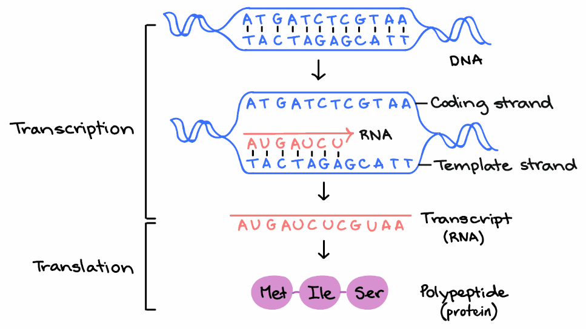

# ORF calling

The first step in identifying the functions of proteins is identifying the genes that encode those proteins. This is called `ORF calling` because we are identifying the *ORFs* &mdash; open reading frames. The protein is the main component of the cell that actually does the work!

Here is a brief recap on the [central dogma of biology](https://en.wikipedia.org/wiki/Central_dogma_of_molecular_biology), the concept that DNA makes RNA makes protein. The image is courtesy of, and copyright 2018, Katelyn McNair.



Notice that DNA is encoded in groups of three bases, called a `codon`. (Each `codon` is `3 bp long`, and they are non-overlapping). 

There are 4<sup>3</sup> = 64 possibilities of choosing three letters from an alphabet of four letters {A, T, C, G}:

Codon | Amino Acid | Codon | Amino Acid | Codon | Amino Acid | Codon | Amino Acid
--- | --- | --- | --- | --- | --- | --- | --- 
AAA | Lys | CAA | Gln | GAA | Glu | **TAA** | **Stop**
AAC | Asn | CAC | His | GAC | Asp | TAC | Tyr
AAG | Lys | CAG | Gln | GAG | Glu | **TAG** | **Stop**
AAT | Asn | CAT | His | GAT | Asp | TAT | Tyr
ACA | Thr | CCA | Pro | GCA | Ala | TCA | Ser
ACC | Thr | CCC | Pro | GCC | Ala | TCC | Ser
ACG | Thr | CCG | Pro | GCG | Ala | TCG | Ser
ACT | Thr | CCT | Pro | GCT | Ala | TCT | Ser
AGA | Arg | CGA | Arg | GGA | Gly | **TGA** | **Stop**
AGC | Ser | CGC | Arg | GGC | Gly | TGC | Cys
AGG | Arg | CGG | Arg | GGG | Gly | TGG | Trp
AGT | Ser | CGT | Arg | GGT | Gly | TGT | Cys
ATA | Ile | CTA | Leu | GTA | Val | TTA | Leu
ATC | Ile | CTC | Leu | GTC | Val | TTC | Phe
**ATG** | **Met** | CTG | Leu | GTG | Val | TTG | Leu
ATT | Ile | CTT | Leu | GTT | Val | TTT | Phe


Note that in this table above I have just sorted the codons alphabetically. There are [several other ways](https://www.google.com/search?tbm=isch&q=codon+usage+table&chips=q:codon+usage+table) to present the same data, many of which are designed to be easier to navigate for manual translation of DNA sequences.

Notice that there is only one codon that encodes Methionine. A derivative of methionine, called [N-formyl methionine](https://en.wikipedia.org/wiki/N-Formylmethionine) is required to start all proteins. N-formyl methionine is encoded by ATG, and thus this is typically (but not always) the start codon. Occasionally CTG or GTG can be used as alternative start codons, however the protein has to start with N-formyl methionine regardless of the codon used.

There are three *special* codons, **TAG**, **TAA**, and **TGA** encode a special amino acid - *Stop!*. They don't really encode an amino acid, in fact what they encode is nothing. This causes the [ribosome](https://en.wikipedia.org/wiki/Ribosome), the machinery that translates DNA into protein, to stall, and the nascent protein is released and translation stops.

## Open reading frames

An open reading frame is a stretch of DNA that can be translated into amino acids and does not contain a stop codon.

This may or may not be made into a protein, it just denotes a region in the genome that has the *potential* to be made into a protein!

## Why are there six reading frames in DNA sequence?

Remember that DNA is read in `codons` consisting of three bases, and DNA is read in a non-overlapping manner. Thus the DNA sequence:

```
    ATG ATC ATT GAC TAT TAA                                                                 (1)
```
could equally well be read:

```
    A TGA TCA TTG ACT ATT AA                                                               (2)
```
or

```
    AT GAT CAT TGA CTA TTA A                                                               (3)
```
however, note that if we shift our register over one more time, we get back to the first case:

```
    ATG ATC ATT GAC TAT TAA                                                                 (1)
```

Then, recall that DNA can be read in the other direction. We normally write the sequence from the 5' end to the 3' end of the sequence. (The numbers here refer to the free carbons in the DNA's ribose backbone - at one end the carbon called the 5'-carbon is free and will have a phosphate group attached. At the other end, the 3' end is free and there is an OH molecule attached.)

Thus, this DNA sequence can also be read

```
    5' - ATG ATC ATT GAC TAT TAA - 3'
    3' - TAC TAG TAA CTG ATA ATT - 5'
```

Then we can read the `complementary strand` (the strand whose sequence is TACTAGTAACTGATAATT) from the right to the left. Again, and for the same reasons as above, we can read that in three different ways depending on where we start, but when we get to the fourth potential start, we're back at the beginning:

```
    TAC TAG TAA CTG ATA ATT                                                     (-1)

    T ACT AGT AAC TGA TAA TT                                                   (-2)

    TA CTA GTA ACT GAT AAT T                                                   (-3)
```

An open reading frame can be *any* stretch of DNA that does not contain a sequence.

*Thought experiment:* In the above sequences, how many open reading frames are there?

## How do we identify genes?

The simplest way to identify the open reading frames is to start by identifying the stops! Recall that there are three stop codons (TAA, TGA, TAG), that always specify a stop (if you are using genetic code 11), but there is a start codon (ATG) that could also be used as a methionine in the middle of the protein. Therefore, we start by identifying the stops, and then look backwards to see if we can find any starts. If we have a start codon, there is a good chance we may be in a protein encoding gene.

The AWS instance includes a program called ORFM that has a very efficient open reading frame predictor. Note that ORFM does not test those predicted proteins to see whether they start with a methionine, and that is left as an exercise for the reader.

To predict all the ORFs in your sequence, you can run ORFM:


```bash
mkdir orfm
orfm -t orfm/orfm.fna assembly/scaffolds.fasta  > orfm/orfm.faa
```

Next, we look at the other strands. Is there a longer protein encoding gene that covers all, or a part, of the gene we just identified? Purely by statistics, we would expect the longer gene to be the correct one. However, note that some genes overlap at their ends - that is normal as it allows the translation machinery to slip along the transcript. A very common overlap is to have a TGA stop codon immediately preceded by an ATG start codon, so that the sequence is **ATG**A. When the ribosome gets to the TGA it stalls, stops creating that protein, backtracks a base, and starts creating the new protein. However, it is unlikely that overlap is more than a few bases on either end.

As an aside, although ATG is by far the most common start codon, occasionally biology will use GTG (and even rarer it will use TTG) as a start codon. However, be aware that in these cases, the translation machinery still has to start the protein with N-formyl-Methionine, the same is if the start codon were an ATG. Some gene prediction software will correctly make this substitution for you, some will not!

However, there are more advanced ways to predict genes. Many of the modern tools use hidden Markov models or interpolated Markov models for more robust predictions. Some approaches also use [traveling salesman](https://en.wikipedia.org/wiki/Travelling_salesman_problem) problem algorithms to find the shortest path through the potential genes.

## Programs to identify protein-encoding genes

There are many great programs for identifying open reading frames in microbial genomes. 

* [Glimmer](https://ccb.jhu.edu/software/glimmer/) uses an interpolated Markov Model to identify the open reading frames.
* [GeneMark](http://exon.gatech.edu/GeneMark/) uses hidden Markov models to identify the open reading frames.
* [Prodigal](https://github.com/hyattpd/Prodigal) uses machine learning to identify the open reading frames.

The AWS image has Prodigal installed and you can use that to identify the open reading frames on your scaffolds.

Prodigal runs in a default mode that doesn't really need a lot of parameters or input: you specify the fasta file that you want to identify the open reading frames in and the output files for you protein and DNA sequences and Prodigal does the rest:

```
mkdir prodigal
prodigal -a prodigal/orfs.faa -d prodigal/orfs.fna -o prodigal/prodigal.out -i assembly/scaffolds.fasta
```

The output comes in three files:
1. The `orfs.faa` file is a fasta file that has the amino acid sequences (the protein sequences; hence the `faa` extension). Each sequence has the contig name appended with a unique number, the start and stop of the gene, and some other information about the gene, including whether the gene is partial, the start codon (see the note above), the ribosome binding site sequence and spacer region, and the GC content of the gene.
2. The `orfs.fna` file is the fasta file that has the nucleic acid sequences (the DNA sequences; hence the `fna` extension). The sequences have the same identifiers as the `faa` file.
3. The `prodigal.out` file that includes the information in GenBank format (by default). The sequences have the following information:

   * `id` the unique ID of the sequence based on the contig name and a number
   * `partial` whether the gene is partial (i.e. it does not have either a start or stop codon before the beginning or end of the sequence).
   * `start_type` the start codon (usually ATG, GTG, or TTG)
   * `stop_type` the stop codon (usually TAA, TGA, or TAG)
   * `rbs_motif` the ribosome binding site (e.g. "AGGA" or "GGA", etc.)
   * `rbs_spacer` the number of bases between the start codon and the ribosome binding site motif.
   * `gc_cont` the GC content of the gene
   * `gc_skew` the GC skew of the gene
   * `conf` a confidence score that represents the probability that this gene is real, i.e. 68.2% means the gene is a true positive 68.2% of the time and a false positive 31.8%.
   * `score` the total score for this gene.
   * `cscore` the hexamer coding portion of the score
   * `sscore` a score for the translation initiation site for this gene; it is the sum of the following three fields.
      * `rscore` a score for the ribosome binding sequence
      * `uscore` a score for the sequence surrounding the start codon.
      * `tscore` a score for the start codon (i.e. ATG vs. GTG vs. TTG vs. others).
      * `mscore` a score for the remaining signals such as the stop codon type and leading/lagging strand bias


