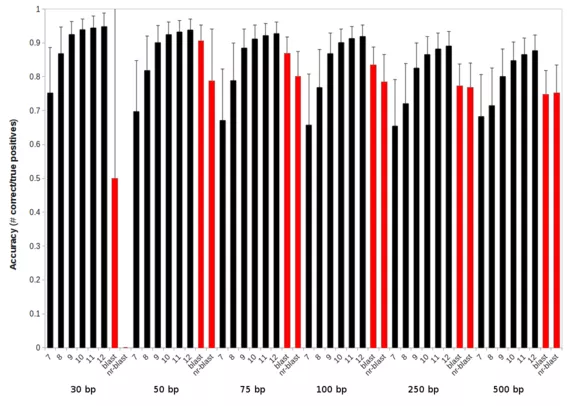

# Annotating the function in the bins using Real Time Metagenomics

[Real-time metagenomics](https://edwards.sdsu.edu/RTMg) is a *k*-mer based approach for annotating metagenomic sequences ([Edwards *et al.*](https://academic.oup.com/bioinformatics/article/28/24/3316/245032)). We have both web- and standalone-versions of real time metagenomics that allow you to quickly view what is going on in your metagenomes.

## The web version - RTMg

The approach employed by the [real time metagenomics website](https://edwards.sdsu.edu/RTMg) is to take the fasta file you provide and split it into smaller chunks. You can set the parameter "File chunks to process" under the advanced parameters, and basically what that does is control how many smaller chunks your file is split into. The DNA sequences you upload are translated in all 6 reading frames, and then those proteins are searched against the signature *k*-mer database that you choose. Under advanced parameters "Word size" parameter you can choose k from 7 through 12. For each sequence, there are two important parameters that you can control, the minimum number of *k*-mer matches you require for a hit to be significant (from 1 upwards; set using the "Stringency" parameter; 1 is the "Least stringent", 4 is "Very stringent"); you can also set the maximum distance between matches (the default is 600bp). For example, it doesn't make sense if two matches are 5,000 bp apart - they are unlikely to be from the same protein.

Give [RTMg](https://edwards.sdsu.edu/RTMg) RTMg a try, you can download all the results as a text file which you can open in Excel.

## Stand alone version

The web version is nice, but what do you do if you have hundreds of thousands of sequences to annotate. You really don't want to wait for the web browser to load. This is where the stand alone versions come in. The stand alone versions are part of the [SEED servers](http://blog.theseed.org/servers/), that are available free for mac, linux, and windows from the [install page](http://blog.theseed.org/servers/installation/distribution-of-the-seed-server-packages.html). (Note, we have not yet installed these on the AWS instance, but they are trivial to install)

Once you have downloaded and installed the SEED servers packages, you still have more options. The first is the desktop `myRAST` stand alone application. This is an application that you can run on your machine and will annotate your metagenomes for you in a graphical interface. The annotation is very similar to that for complete genomes, described in the [RAST blog](http://blog.theseed.org/servers/presentations/t1/running-a-job-with-the-desktop-rast.html).

The second approach is via the command line. If you install `myRAST`, you also get access to all of the `SEED server scripts`, including scripts that allow you to annotate metagenomes from the command line. This is the quickest, and most efficient way of annotating metagenomes I know of. Download the appropriate installer, and install the SEED servers as directed. Then, open a terminal window and type `svr_` and press tab twice and you will see a long list of all the `svr_` commands you installed (provided you have `bash completion` installed, which you almost certainly do). All of those are ways to access the SEED using the command line and the servers. Now, all the SEED data is at your fingertips.

The two key components that we'll need for this are: `svr_assign_to_dna_using_figfams` and `svr_roles_to_subsys`.

You can get the command line options for each by adding the `-help` to the line:

```bash
svr_assign_to_dna_using_figfams -help
```

We'll start by annotating the DNA sequences. This command will annotate the sequences in the file `mymetagenome.fna` and print the results to the screen.

```bash
svr_assign_to_dna_using_figfams -kmer=9 -reliability=2 -maxGap=600 < mymetagenome.fna
```

The parameters here include using a *k*-mer size of 9, a reliability factor of 2, which means that at least two *k*-mers should hit for every sequence that is called a match, and a maximum gap of 600, which means that the longest distance between two gaps can be 600bp. (See which parameters should I use, below).

The output from this command is a table with four columns:

The sequence id in the fasta file

The number of k-mers that match

The position of the match in the format sequence id_start position_stop position. Underscores are used as the joining character here.

The functional role assigned to the match

The organism that the assigned match came from (if possible to identify)


The number of k-mers that match is an indication of the stringency of the match and you may want to filter the results somewhat based on this value (see below). The organism that matched is provided if the k-mer directs to a single organism, otherwise a null value is returned.

Of course, we really want to redirect the output to a text file, so we'd probably use something like this:

```bash
svr_assign_to_dna_using_figfams -kmer=9 -reliability=2 -maxGap=600 < mymetagenome.fna > annotated.metagenome.txt
```

The next thing we would like to know, is for each of these functions how do we figure out the subsystems that they are in? There is another `svr_` command that will provide that information:

```bash
svr_roles_to_subsys -c 4 < annotated.metagenome.txt > annotated.metagenome.with.subsystems.txt
```

The `-c 4` on this command means use the function in column 4 of the input file, and find all subsystems that function is present in.

The output from that command is a table just as before, but with additional columns for the subsystems and the two level hierarchy for the subsystems appended to the table. Also note that there is a one-to-many mapping here, because each functional role can be in more than one subsystem. Thus this table will almost certainly have more lines than your original table.

If you are like me, the first thing you'd like to know is which subsystems are present in your sample. This is very easy to do with this type of text output:

```bash
cut -f 6 annotated.metagenome.with.subsystems.txt | sort | uniq -c | sort -nr | less
```

This will give you counts of all of the subsystems that are found in your metagenomes, sorted from most abundant to least.

## Which parameters should I use?

There are a lot of parameters that you can vary, and like everything its a matter of personal preference what you choose. BLAST has the E value, percent identity, or alignment length, all of which indicate some level of confidence in the alignment.

In the *k*-mer approach, the two main parameters that you vary are the number of *k*-mers that match a sequence and the length of those *k*-mers. Using longer *k*-mers (10-, 11-, or 12-mers) will reduce the number of hits and demand more stringent matches, like increasing the E value cutoff. Using shorter *k*-mers (7-, 8-, or 9-mers) will reduce the stringency of the matches, like decreasing the E value.

This graph compares the accuracy of using 7-, 8-, 9-, 10-, 11-, and 12-mers against blast (the red bars) using either the database used to create the *k*-mers (blast) or the whole non-redundant database (like that used by mg-rast; nr-blast). The groups along the x-axis are different fragment lengths of metagenome sequences from 30bp through 500 bp, mimicing typical metagenome fragment sizes.
kmer_accuracy

Likewise, increasing the number of *k*-mers that are required to match a sequence will increase the stringency. If that number is increased above 4 or 5 most of the matches are highly similar matches. The nice thing about the number of matches is that we provide that in the output file (column 2), so you can always post-process the data if it looks like two matches per sequence is too relaxed.

The data in the figure required two *k*-mer matches per sequence.

## Recommendation

My recommended parameters for metagenomes, to start with, are 9-mer searches that require two *k*-mer hits in 600 bp or less. I also advise running the search and taking a few of the sequences that you get matches on and blasting them at NCBI or SEED and seeing if you agree with the results. The great thing is that the *k*-mer search is so quick you can always alter the parameters and see what happens.

