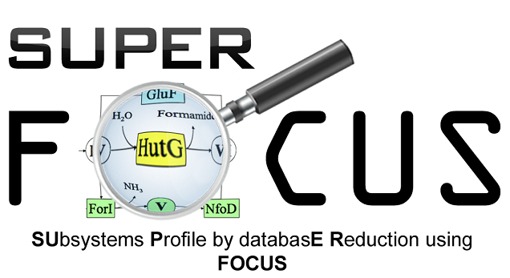

# Annotating the function in the bins with SUPER-FOCUS



Subsystems Profile by database reduction using FOCUS (SUPER-FOCUS) combines the taxonomic profiling using FOCUS, which is rapid, and the functional profiling using *k*-mers or faster searches than blast using alternate algorithms including [diamond](https://github.com/bbuchfink/diamond) or [RAPsearch](http://omics.informatics.indiana.edu/mg/RAPSearch2/). 


SUPER-FOCUS input is be the same as FOCUS &mdash; you just need a  folder with all the sequences from your metagenome. You can have one or more sequences in the folder, and they can be reads, or [metagenome assembled genomes](../CrossAssembly). 

First download the database by running 

```bash
superfocus__downloadDB -a diamond
```
to download the database for the diamond search algorithm (which is the fastest, but also requires the most memory).

Then to run superfocus, you use the command (e.g. for Algae_MetaBatBins) 

```bash
superfocus.py -q Algae_MetaBatBins -m 1 -db DB_90 -dir Algae_MetaBatBins_Superfocus_results
``` 

The SUPER-FOCUS results for all the bins are saved in a folder called `SUPER-FOCUS` and are self explanatory!

