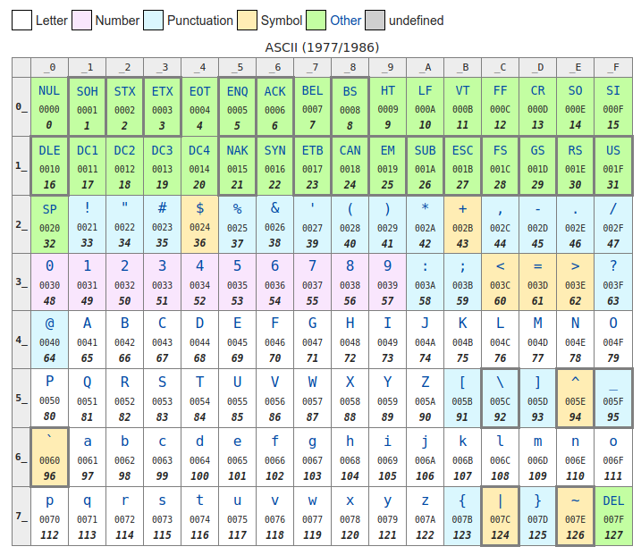
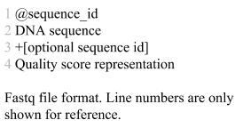
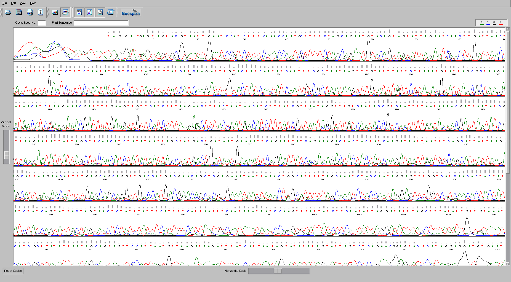

# Sequence File Formats

## Introduction

Over the years we have needed standardized file formats to house sequence data. Of course, as new ideas have emerged, technology has developed, computational power increased, and bioinformatics software improved, those formats have developed and improved.

## fasta format

Originally a file format was needed to handle DNA sequences that was straight forward and would allow bioinformaticians to store the DNA sequence and information about where it came from. One of the simplest formats was designed by **David Lipman** and **William Pearson** from the University of Virginia, and soon became a de facto standard and is called ***fasta*** format. In this format, the line that contains the identifier for the sequence and the description starts with a greater than sign (yes, computer scientists like to use that sign!), and all other lines are deemed to be sequences. A fasta file might look like the example shown here.


The characters after the ‘>’ and up until the first white space are considered the identifier for the sequence and should be unique within the file (i.e. you should not have two different sequences with the same identifier). The information after the first space is optional and can be a description of the sequence, some semi-structured data, like in the third example where it shows the organism and the function of the protein, or anything you would like. Remember that we discussed non-redundant databases in the [databases section](../Databases)? In most non-redundant databases, the sequence starts with a unique ID, and then contains a list of all of the IDs that contribute to that sequence.

As we discussed in the [sequencing section](../Sequencing), when you are sequencing, you need to keep track of the quality scores that estimate the [error rate](../Sequencing/README.md#errors-in-dna-sequencing). For Sanger sequencing and with some of the early high-throughput approaches, a separate file called a quality file was used. That has the quality scores separated by spaces, one quality per base. There should be the same number of bases as there are quality scores!


## fastq format 

However, as sequencing became more popular, and the amount of sequences increased, this became an increasingly unsustainable way of keeping the data. First, for every sequence, you need two files, a quality scores file and a DNA sequence file. That means you are likely to loose one of those files somewhere along the way (i have lost many of them!). Second, it is not easy to ensure that every sequence has a quality score associated with it, and every base in every sequence has a quality score associated with it! 

The solution that was settled upon was to combine the sequences and quality scores into a single file, called a ***fastq*** file. The name comes from *fasta + quality*! This file has every sequence and its associated quality score.

However, instead of storing the numbers as digits, like in the quality file above, we choose to store the numbers as single characters! This means that every quality score is exactly as long as the sequence that it refers to, as there is a single character per quality score.  To convert the numbers to characters, we use the [Unicode tables](https://en.wikipedia.org/wiki/Unicode). These tables (a part of which is shown here), have a decimal number to represent every character of the alphabet, including the extended alphabet from different languages, and now emoji, too. 



However, notice in the table above that the first 31 numbers include all the keys on your keyboard like backspace, tab, and delete, and #32 is a space, which is not so useful if we want to store them in a file one character per line (how would *you* store a backspace?). Therefore, to convert a phred score to a fastq score, we **add 33** to the number and use the character from this table. Some examples are shown in the table below.


Quality Score | Unicode number | Character in fastq file
--- | --- | ---
0 | 33 | !
10 | 43 | +
32 | 65 | A
64 | 97 | a

The other changes that was made compared to fasta files were to ensure that fastq files were easy to test for integrity and to be able to rapidly identify a fastq file from a fasta file.

First, fastq files have four lines for each entry, and second, instead of using the greater-than sign (“>”) to delimit the ID, fastq files use an @ sign and a + sign. The order of the file is shown in the box below.



The first line for each sequence begins with an @ sign and has the sequence ID, up to the first white space, and as with fasta files, after the space can have additional optional information. The second line has just the DNA sequence, with nothing else, and the sequence must be on one line (without new lines). The third line begins with a + sign, and optionally also includes the sequence ID (but does not need to), and the fourth and final line has the representation of the quality scores without any spaces.

*Note*: The standard fastq specification does not enforce this four line per entry format. You are allowed to insert line breaks in sequences and/or qualities. However, most software nowadays requires this four line format and breaks if you don't provide it.

*Thought Experiment*: What happens if the first base in your sequence has a quality score of 31?<sup>[1](#footnote1)</sup>

### Converting between fastq and fasta or fasta and fastq

One of the most common applications in bioinformatics is to convert from fastq to fasta format. You can also go the other way if you have the quality scores!

When you are converting from fastq to fasta, some programs will generate two files, and others will only make a single file. For example, we have [a simple website](http://edwards.sdsu.edu/redwards/cgi-bin/fastq2fasta.cgi) that will take a fastq file and generate a fasta file of just the DNA sequence, ignoring the quality scores of the sequences. 

The command line application `prinseq-lite.pl` can do It for you too. prinseq-lite.pl was the [initial version of prinseq](http://prinseq.sourceforge.net/) written by [Rob Schmieder](https://www.ncbi.nlm.nih.gov/pubmed/?term=21278185). If you are interested in using it we have a [newer version written in C++](https://github.com/Adrian-Cantu/PRINSEQ-plus-plus) by Jeff Sadural and Adrian Cantu. The `-out_format` option takes several parameters that you can specify on the command line. With `prinseq-lite.pl` you can just specify an input file and the appropriate `-out-format` option and generate the fasta and quality files. This will ensure that the files have unique names.

We also have two command line versions included on the Amazon Web Services image: `fastq2fasta` is faster (as it is written in C++) and is probably the preferred option for converting fastq files to fasta files (Be sure to replace Algae_12.fastq with your filename):

```
fastq2fasta Algae_12.fastq  Algae_12.fasta
```

Note, however, if your file is compressed, for example with GZIP, you need to uncompress it first. You can do this on the fly using a [pipe](../Linux/README.md#pipes) like this:

```
gunzip -c Algae_12.fastq.gz | fastq2fasta - Algae_12.fasta
```

This command unzips the compressed file and prints the output to standard out. Then it reads the output from standard output and converts it to fasta and saves that in the new file `Algae_12.fasta`. 

You can also use the awesome [seqtk library](https://github.com/lh3/seqtk) from Heng Li. The command to convert fastq to fasta is:

```
seqtk seq -A Algae_12.fastq.gz > Algae_12.fasta
```

However, these commands do not convert the quality scores as well, and so if you want those you might want to use `prinseq-lite.pl`

If you want to convert several files from fastq to fasta, and they are gzipped, we can do that in a loop, like this:

```
for FQ in $(ls fastq/); do
	FA=$(echo $FQ | sed -e 's/fastq.gz/fasta/');
	echo $FQ $FA;
	gunzip -c fastq/$FQ | fastq2fasta - $FA;
done
```


The first line in this loop reads the file name of every file in the `fastq/` directory. The second line makes a new variable called `FA` that replaces `fastq.gz` with `fasta`. The third line just prints the file names so you can see what we are working on, the fourth line uncompresses the fastq file but prints the uncompressed version out, and uses a [pipe](../Linux/README.md#pipes) to pass that inforamtion to `fastq2fasta` which reads from `STDIN` (that’s what the `-` sign means) and writes the output to `$FA`.

Other options to convert from fastq to fasta include the brilliant [seqtk](https://github.com/lh3/seqtk) toolkit that is also included on the Amazon Web Image for the course.

## BAM and SAM format

With the advent of large sequencing projects like the human genome sequencing efforts, a lot of bioinformatics focus shifted from *de novo* assembly and annotation of genome sequences to mapping and characterizing *differences between genomes*.

*Thought experiment*: Why do we want to look at the differences between human genomes rather than perform *de novo* annotations?<sup>[2](#footnote2)</sup>

### SAM format 

The Sequence Alignment/Mapping format (SAM) format was first described by [Li *et al*](https://www.ncbi.nlm.nih.gov/pubmed/19505943) and has rapidly become one of the leading file formats.

The SAM format contains two sections. The header sections have lines that begin with the *@* symbol, and contain information about the SAM specification to which the file adheres, and the reference sequence involved in the alignment. (Remember, SAM files are reporting the alignment of a lot of different sequences to one (or maybe more) reference sequences).

The line that begins `@HD` can contain header information including the version (`VN:`), the sorting order (`SO:`) of the alignments, and the grouping order (`GO:`) of the alignments.

There can be one or more header lines that start `@SQ`, and these describe the reference sequences in the file (to which all the other reads have been mapped). Each `@SQ` line can have multiple entries, including `SN:` the reference sequence name; `LN:` the reference sequence length; `AN:` alternate names for this sequence; `AS:` how the reference was assembled; `M5:` the [MD5 sum](https://en.wikipedia.org/wiki/Md5sum) of the sequence; `SP:` the species; and `UR:` the URL for the sequence.

After the header lines comes the alignment lines. Each line has 11 fields that are required and the fields are separated by tab symbols. The fields are:

Column number | Field Name | Type | Description
--- | --- | --- | --- 
0 | QNAME | String | The query sequence name
1 | FLAG | Int | THe bitwise flag (see below)
2 | RNAME | String | The reference sequence name
3 | POS | Int | The left most mapping position. 1-indexed (i.e the first base is position 1)
4 | MAPQ | Int | The mapping quality
5 | CIGAR | String | The CIGAR string for the alignment (see below)
6 | RNEXT | String | The reference name of the mate or next read
7 | PNEXT | Int | The position of the mate or next read
8 | TLEN | Int | The observed template length
9 | SEQ | String | The sequence of the segment
10 | QUAL | String | The ASCII representation of the quality score + 33


### Bitwise flags

The FLAGs in the second column (column 1) are comprised of a bitwise combination of the following numbers:

Bit | Description
--- | ---
1 | Template has multiple segments that align
2 | Each segment is properly aligned
4 | The segment is unmapped
8 | The next segment is unmapped
16 | The sequence is reverse complemented
32 | The sequence of the next segment is reverse
64 | The first segment in the template
128 | The last segment in the template
256 | A secondary alignment
512 | not passing filters (e.g. QC)
1024 | PCR duplicate
2048 | supplementary alignment

The number that ends up in the column is the sum of appropriate numbers. Therefore, if we have 2+16+64 = 82 we know that the sequence is properly aligned, is reverse complemented, and is the first segment in the alignment.

### CIGAR string

The CIGAR string is a representation of the sequence alignment in abbreviated form. The letters mean:

Code | Description
--- | ---
M | Alignment match (but could be a sequence match or mismatch!)
I | Insertion relative to the reference
D | Deletion from the reference (i.e. insertion relative to the query!)
N | Reference skipped
S | soft clipping
H | Hard clipping
P | Padding
= | Sequence match
X | Sequence mismatch

Thus the CIGAR string 2M1D3M means there are two matches, 1 deletion in the reference (an insertion in the query), and three more matches.

[Here are some more example CIGAR strings](https://jef.works/blog/2017/03/28/CIGAR-strings-for-dummies/)

### BAM format

BAM format is merely a binary representation of SAM format. That means that it is very quick for computers to read and parse BAM files, but that you basically can't view them without a bam viewer.

When we create sequence alignments, we often just skip the creation of the SAM format file altogether, and just make a binary BAM file, using [Linux pipes](../Linux/README.md#pipes) as we have seen before.

For example, this is a common command that we will use:

```
bowtie2 -p 6 -q --no-unal -x crassphage.bt2 -1 reads.r1.fastq -2 reads.r2.fastq | samtools view -bS - | samtools sort -o outputdir/crassphage.reads.bam -
```

This command takes a bowtie2 indexed file (`crassphage.bt2`) and two read files (`reads.r1.fastq` and `reads.r2.fastq`) and uses `bowtie2` to compare the reads to the crassphage reference. Then we convert the output to BAM format using the `-bS` option to samtools view, and finally sort the reads in the bam file (which makes indexing and accessing the data much quicker).

Notice that we don't save the intermediate sam file - we create it on the fly and pass it straight into the conversion to binary format.

### Viewing BAM files

The best BAM file viewer that we routinely use is the unfortunately named [Tablet](https://ics.hutton.ac.uk/tablet/) from the James Hutton Institute. (The naming is unfortunate as it is not easy to find!). If you use this be sure to check out their references describing Tablet [Using Tablet for visual exploration of second-generation sequencing data](https://www.ncbi.nlm.nih.gov/pubmed/22445902) and [Tablet: Visualizing Next-Generation Sequence Assemblies and Mappings](https://www.ncbi.nlm.nih.gov/pubmed/26519411).

### More information about SAM and BAM files

You can find a lot more information about SAM and BAM files at [htslib.org](http://www.htslib.org/doc/), the site of samtools and associated software. samtools and all required dependencies are already installed in our Amazon Web Image.

## DDBJ/EMBL/Genbank Format

Each of the INSDC members has a file format that was designed to be a rich, human readable, file format that could encapsulate all of the data about a sequence. The standard genbank file definition includes using different numbers of spaces as separators to mean different thing. This makes these files tricky to parse - it is not difficult, you just need to be very careful about all the edge cases where lines wrap, where additional things are included, and what is absolutely required and what is optional. Because of this, I recommend using one of the standard library parsers for parsing DDBJ/EMBL/Genbank format files. For example, [BioPerl](https://bioperl.org/), [BioPython](https://biopython.org/), [BioJava](https://biojava.org/), and [Bioconductor for R](https://www.bioconductor.org/) all have built in parses for these files. This is one of the undoubted advantages of open source software - when the DDBJ/EMBL/Genbank definitions are updated, a team of developers will improvee the parsers and test them to ensure they work.

A big advantage of using these files is that they have a fixed vocabulary. For example, they have [described the features](INSDC_Features.md) that may be used in their files. Only these features can be included and anything else is not a valid file format. 


## ABI or AB1 format

This is a proprietary file format that is specifically designed to handle trace files from ABI sequencing machines. The traces are the measures of the sequence peaks as they flow through the sequencer and are used in base calling the sequences. For example, this trace file was viewed with [FinchTV](https://digitalworldbiology.com/FinchTV).


It is somewhat of a legacy file format, and it is quite difficult to find software to read this format anymore. [Geneious](https://www.geneious.com/) and [FinchTV](https://digitalworldbiology.com/FinchTV) maybe your last hopes!

## PDB

The Protein Data Bank (PDB) format is most commonly used to store three dimensional structural information about protein crystal structures.  This file format includes the positions of the atoms in the structure, as well as annotations and information about the protein that was crystallized. Although PDB files are plain text, they are not really suitable for viewing without a third part application. Typically people view PDB files with either [PyMol](https://pymol.org/2/) or [RasMol](http://www.openrasmol.org/) although there are other viewers out there.

## BLAST m8

The BLAST m8 format has become a _de facto_ standard because it is quite straightforward. It is widely used by sequence alignment programs to summarize results. The data is tab-separated and has the following columns:

Column | Content
--- | ---
0 | Query sequence ID
1 | Subject (database) sequence ID
2 | Percent Identity
3 | Alignment Length
4 | Number of gaps
5 | Number of mismatches
6 | Start on the query sequence
7 | End on the query sequence
8 | Start on the database sequence
9 | End on the database sequence
10 | E value - the expectation that this alignment is random given the length of the sequence and length of the database
11 | bit score - the score of the alignment itself


<sup><a name="footnote1">1</a></sup> Answer: For a quality of 31, the symbol would be 31+33 = 64. Checking the ASCII chart, the symbol that would be inserted is an *@* symbol. Note that is used to start the sequence ID, so you can **not** just grep for lines beginning with the @ symbol to find sequence IDs.

<sup><a name="footnote2">2</a></sup> Answer: For the most part we are interested in the differences that are causing some effect. For example, consider cancer sequencing. We often sequence both unaffected cells to get their genome, and part of the tumorous region to see what has changed. It turns out that most humans are the same, and the differences are the only interesting thing!
