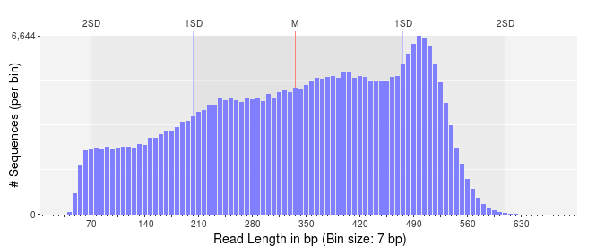
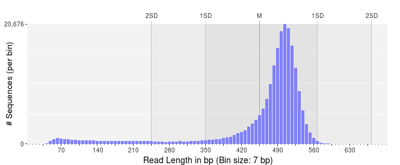
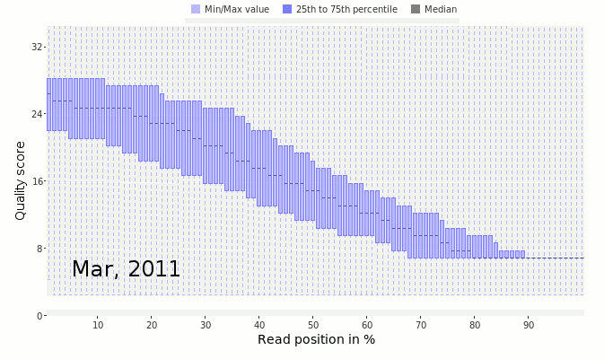

# Sequence Quality Control

In the early days of DNA sequencing, we used polyacrylamide gels to separate DNA fragments based on size. These fragments move through the gel, propelled by an electric current (DNA is negatively charged), and the larger fragments get retarded by the gel while the smaller fragments move through faster.


Size separation is not a binary process – there is overlap between closely related fragments, and you can change the amount of overlap by altering the composition of the gel, making it thicker, which increases resolution at a cost of a smaller region of the sequence being separated, or making it thinner which decreases resolution but allows a larger region to be visualized.

This leads to a problem, however. How certain are you about the base that you have sequenced? In the image shown here, at the beginning of the trace we are relatively certain of the sequence, however at the end of the sequence we are not so sure what the bases are.

To overcome this problem, people sequenced the same gene many times, starting at different places, and in both directions. This allowed them to build models of the accuracy of base callers under different circumstances. The best software to do this was called [phred](http://www.phrap.org/phred) and their  quality score is based on the formula:

Q = -10 log<sub>10</sub>(P<sub>e</sub>)

Where Q is the quality score, and P<sub>e</sub> is the probability of error in the base call. Quality scores range from 0 to 99, although 99 is usually used to mean that you have artificially inserted a sequence at that position (e.g. through manually editing the sequence). 


*Thought Experiment*: If we begin to analyze that data without doing any checks on the data, what will happen?<sup>[1](#footnote1)</sup>

When we look at sequence data, we want to make sure that there are few errors in our sequences and that we remove those potentially erroneous sequences from our dataset before continuing on with the analysis.

*Thought Experiment*: How do we know which sequences are bad?

First, lets take a look at the distribution of sequence lengths. If our reads have a very broad distribution of sequence lengths, like this figure below, it means that some of the reads terminated early, and some continued through the full run of the sequencer. This suggests that there is something affecting our sequence quality and we should be wary of these sequences.



In contrast, if we have a very narrow distribution of sequence lengths, like that shown below, we can be more assured that are DNA preparation and library preparation was successful, and all of our reads are of high quality. 



In this latter case, I would still be inclined to trim the sequences to remove the shorter reads.

*Thought experiment*: Based on what you know, what type of sequencing do you think was used to generate these reads?<sup>[2](#footnote2)</sup>

Next, look at the distribution of quality scores along the sequences as a whole. In this next figure, we have the quality scores from Ion Torrent sequencing taken as they improved the quality of the sequencing by changing reagents and protocols.



The *x-axis* shows the normalized position along the read in percent (to account for the difference in individual read lengths shown in the above two figures). The *y-axis* shows the average quality at the position across all the reads. Notice that in March 2011 (early on in the development of the Ion Torrent) the quality scores dropped off very quickly along the read. This is a bad sign that suggests the sequencer is uncertain of the quality of those sequences. In contrast, by February 2012, the quality had drastically improved and there was good quality sequence along the length of the read.

The data shown here comes from [Dutilh *et al*, 2014](https://www.ncbi.nlm.nih.gov/pubmed/25096633)

*Thought experiment*: As we noted in [sequencing](../Sequencing/README.md#errors-in-dna-sequencing), new sequencing technologies are quite accurate. How should you trim your sequences if they are very accurate? Is there another measure you can use to determine if a sequence is untrustworthy? 


**In general, if there are reads with low quality sequence, you should discard them!**

***Rule of thumb:*** if you have a sequence with an `N`, discard it!

This is a good rule of thumb for Illumina sequences. If the sequencer can't discern the base it probably means the entire sequence is bad.

### Two-bit encoding

Several computational algorithms use two-bit encoding for DNA sequences. In two-bit encoding each base is encoded by either 00, 01, 10, or 11, and this allows the strings to be manipulated quickly.

A typical two-bit encoding would look like this:

Base | Encoding
--- | ---
A | 00
C | 01 
G | 10
T | 11

*Thought experiment*: What happens if you have two-bit encoding and you need to put an `N` into the sequence?<sup>[3](#footnote3)</sup>

## How to check the quality of your sequences

There are two common applications for checking the quality of your sequences. [fastqc](https://www.bioinformatics.babraham.ac.uk/projects/fastqc/) is a graphical program that allows you to look at a bunch of characteristics of your sequences. 

prinseq-lite.pl is a  command line program that allows you to process your sequences, removing N’s, low quality reads, parts of reads, and looking for tags. prinseq-lite.pl was the [initial version of prinseq](http://prinseq.sourceforge.net/) written by [Rob Schmieder](https://www.ncbi.nlm.nih.gov/pubmed/?term=21278185). We have a [newer version written in C++](https://github.com/Adrian-Cantu/PRINSEQ-plus-plus) installed on the Amazon Web Images. 

Prinseq-lite.pl also has an accompanying website that will make the graphical files for you, including graphs of the quality of your sequences.You can upload your sequences to [our website](https://edwards.sdsu.edu/prinseq/), but you will have to wait for all the sequences to be processed. It is not normally a problem, but if a whole class of students uploads sequences it can take a long time to process them! 

As an alternative, you can process the data on the Amazon Web Image, using the commands below, and then upload the processed graphics files to the website to render the images. This is often much faster than relying on our resources which may be bottle-necked by classes!

### PRINSEQ commands

The manual for prinseq is available [on sourceforge](http://prinseq.sourceforge.net/) and the [prinseq website](https://edwards.sdsu.edu/prinseq/) has more information. The Amazon Machine Image has prinseq-lite.pl installed, and you can run it with these commands.

To generate a graph file that you can upload to https://edwards.sdsu.edu/prinseq use (Be sure to replace Algae_12.fastq with your filename.):

```
prinseq-lite.pl -verbose -fastq Algae_12.fastq -graph_data Algae_12.gd -out_good null -out_bad null -graph_stats ld,gc,qd
```

Note that if you have two files, e.g. for paired end sequencing, you can include them both in prinseq

```
prinseq-lite.pl -fastq SRR3466404_pass_1.fastq -fastq2 SRR3466404_pass_2.fastq -graph_data SRR3466404.gd -out_good null -out_bad null -graph_stats ld,gc,qd
```

To filter the sequences to remove any sequence with an N, and to generate two files (one with the sequences without an N, and the other that has the sequences with N’s). Be sure to replace Algae_12.fastq with your filename.

```
prinseq-lite.pl -verbose -fastq Algae_12.fastq -ns_max_n 0 -out_good seqs_no_ns -out_bad seqs_with_ns
```

***

<sup><a name="footnote1">1</a></sup> Answer: Garbage in, gargbage out. Withouth doing QC you are working on sequences that are just errors from the machines and are meaningless!

<sup><a name="footnote2">2</a></sup> Answer: Looking at the scale on the *x-axis* you should notice that the median length is about 500 bp which rules out Illumina technology. Now notice that there are lots of sequences per bin - look at the scale on the *y-axis*, so that probably rules out Sanger sequencing, and potentially rules out Nanopore and PacBio sequencing. What's left? 454 Pyrosequencing.

<sup><a name="footnote3">3</a></sup> Answer: there are two solutions that are probably equally correct: (i) convert all `N` bases to `A` bases; or (ii) replace each `N` base with a random base.