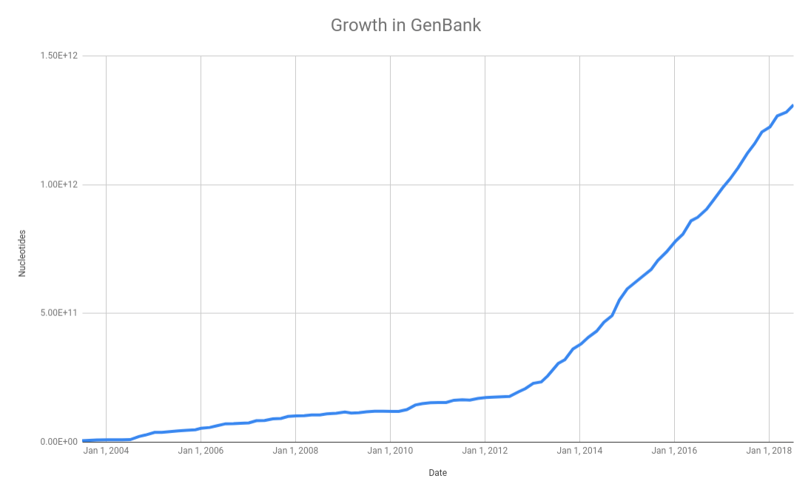
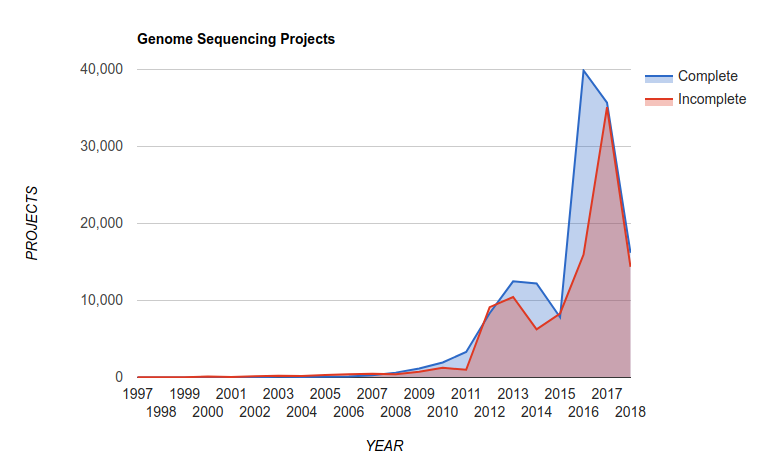
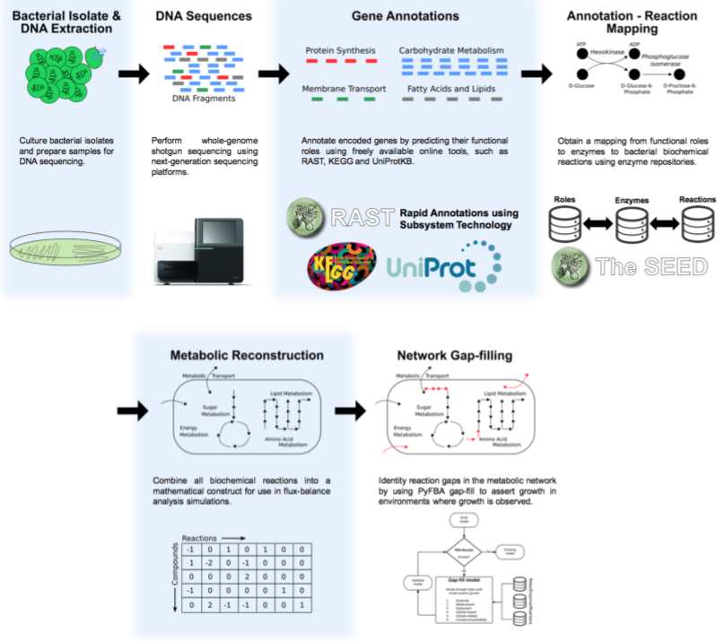

# Whole Genome Shotgun Sequencing

Before we begin, some thought experiments:

*Thought experiment*: How big are genomes of phages, Bacteria, Archaea, Eukarya?[1](#footnote1)

*Thought experiment*: Suppose that you want to sequence the genome of a bacteria that is 1,000,000 bp and you are using a sequencing technology that reads 1,000 bp at a time. What is the least number of reads you could use to sequence that genome?[2](#footnote2)

A long time ago, when sequencing was expensive, these two questions kept people awake. For example, Lander and Waterman published a paper [describing the number of clones that need to be mapped (sequenced)](https://www.ncbi.nlm.nih.gov/pubmed/3294162) to achieve representative coverage of the genome. Part of this theoretical paper is to discuss how many clones would be needed to cover the whole genome. In those days, the clones were broken down into smaller fragments, and so on and so on, and then the fewest possible fragments sequenced. Because the order of those clones was known (from genetics and restriction mapping), it was easy to put them back together.

In 1995, a [breakthrough paper was published in Science](http://science.sciencemag.org/content/269/5223/496) which the whole genome was just randomly sheared, lots and lots of fragments sequenced, and then big (or big for the time &em; your cell phone is probably computationally more powerful!) computers used to assemble the genome.

This breakthrough really unleashed the genomics era, and opened the door for genome sequencing including the data that we are going to discuss here!

As we will discuss in the [databases](../Databases/) class, the NCBI GenBank database is a central repository for all the microbial genomes. In their [release notes](ftp://ftp.ncbi.nih.gov/refseq/release/release-statistics/bacteria.acc_taxid_growth.txt) they summarize the growth in the number of bases over the last few years:

and this translates into a growth in the number of complete microbial genomes released over the last few years as reported in the [Genomes Online Database](https://gold.jgi.doe.gov/statistics):

There are now over 300,000 complete genomes in the GOLD database! *Read the last version of their paper [Genomes OnLine Database (GOLD) v.6: data updates and feature enhancements Nucl. Acids Res. (2016); doi: 10.1093/nar/gkw992](https://www.ncbi.nlm.nih.gov/pmc/articles/PMC5210664/)*

Also, at the time of writing this (September, 2018), [PATRIC](http://patricbrc.org) reported [177,395 bacterial genomes](https://www.patricbrc.org/view/Taxonomy/2) in their database.

*Thought experiment*: Back in the 1990s, we had a few tens of genomes. In the late-1990s we were betting on whether we would reach 100 complete genomes. What happened? Why do we now have hundreds of thousands of genomes?[3](#footnote3)

## How do we sequence a genome?

For a standard microbial genome, we start by extracting the DNA from a culture. There are lots of kits and approaches to do this that are standardized and give high yields of clean, and largely high molecular weight DNA (i.e. the DNA strands are long and largely unbroken). For example, [ThermoFisher](http://www.thermofisher.com/us/en/home/life-science/dna-rna-purification-analysis/genomic-dna-extraction/) and [Qiagen](https://www.qiagen.com/us/shop/sample-technologies/dna) both make excellent DNA extraction kits (as do other companies too!). 

Once the DNA has been isolated, we fractionate it to make smaller fragments. There are several ways to do this, but two of the most popular are using the [Covaris](https://covaris.com/instruments/) ultrasonicator or the [Illumina Nextera tagmentation](https://www.illumina.com/content/dam/illumina-marketing/documents/products/technotes/nextera-xt-troubleshooting-technical-note.pdf) protocol. The former uses sonication to physically break the DNA, while the latter uses an enzyme to integrate a transposon into the DNA as shown below:

For a successful library prep, the tagmentation approach requires the DNA to be cleaved by two different (but very similar) transposons. How do they achieve this? 

The transposon is based on Tn*5*, and is synthesized *in vitro*. Next, the monomeric Tn*5* is mixed with two different oligos that have different indexes, Illumina typically uses the *N5-* and *N7-* indexes while 454 sequencing used *A* and *B* primers. The monomeric transposase is dimerized in a buffer containing MgCl2, and since the monomors are equimolar there are three possible outcomes for the dimers:
1. Both members of the dimer have the *A* or *N7-* tag. This should happen 25% of the time
2. Both members of the dimer have the *B* or *N5-* tag. This should happen 25% of the time
3. One member of the dimer has the A or *N7-* tag and one member has the *B* or *N5-* tag, and this should happen 50% of the time.

After the DNA has been cleaved, a few rounds of PCR are used (called [*suppression PCR*](http://www.nature.com/app_notes/nmeth/2009/091011/full/nmeth.f.272.html)) to enrich for only those DNA molecules that contain boh *N7-* and *N5-* (or *A* and *B* in the case of 454). That DNA is the input into your sequencing run. 

See this [seqanswers thread](http://seqanswers.com/forums/archive/index.php/t-50155.html) for a more detailed discussion about how tagmentation works.

*Thought experiment*: What are the advantages and disadvantages of each of these approaches?

Once the DNA has been sheared to an appropriate size (*what size would be appropriate?*), adapters are added to the ends of the DNA. A common approach is the [Swift Biosciences 2S](https://swiftbiosci.com/wp-content/uploads/2016/11/16-1117_SellSheet-2S-Family-v4-hires_no-crops.pdf) DNA library kits.

Finally, the DNA with the adapters can be sequenced using the Illlumina [HiSeq](https://www.illumina.com/systems/sequencing-platforms/hiseq-2500.html) which generates about 1 Terabase of reads. Each run generates about 300 million reads, and each read can be upto 250 bp in total, reading 125 bp from each end of the read. The HiSeq takes about 6 days to run (read more about the [HiSeq specifications](https://www.illumina.com/systems/sequencing-platforms/hiseq-2500/specifications.html)). Alternately, you can use the Illumina [MiSeq](https://www.illumina.com/systems/sequencing-platforms/miseq.html) that generates about 15 GB of sequence, which comes from about 25 million 300 bp reads from each end and takes about 56 hours to run (read more about the [MiSeq specifications](https://www.illumina.com/systems/sequencing-platforms/miseq/specifications.html)).

*Though experiment*: How much sequencing do you need for a bacterial genome?[4](#footnote4)

Instead of using the Illumina systems, more and more genomes are being sequenced using the [PacBio SMRT sequencing](https://www.pacb.com/smrt-science/smrt-sequencing/) and the [Oxford Nanopore Minion](https://nanoporetech.com/products/minion) DNA sequencer. The advantage of these two technologies is that they both produce much longer reads - in the range of 10-40 kbp versus 100-300 bp for the Illumina, which makes downstream assembly and processing much more straightforward.

---
<a name="footnote1">1</a> Answer: on average, phages are 50kb, Bacteria and Archaea are 2 Mb, and Eukarya are 2GB

<a name="footnote2">2</a> Answer: Of course, if you knew exactly the order of the reads, you could sequence 1,000 reads and sequence the whole genome.

<a name="footnote3">3</a> Answer: First, [the cost of sequencing](../Sequencing/README.md#cost-of-dna-sequencing) dropped drastically, and second, we realized the amazing amount of information we can get from hundreds of genomes.

<a name="footnote4">4</a> Answer: The average bacterial genome is about 2,000,000 bp, and for good assembly with Illumina data you need about 100x coverage, so you need about 0.2 Gbp (200,000,000 bp) of sequence data. Therefore, you can sequence a lot of genomes on a HiSeq! However, assembly is much better with long read systems like the Minion or PacBio.

