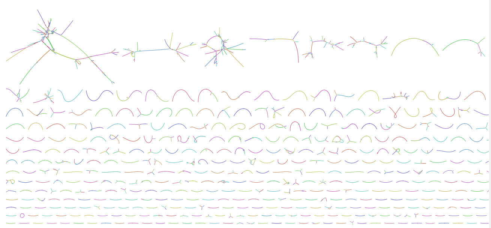

# INRB Metagenomics Workshop, 2023

INRB, Kinshasa, DRC. 2023


# Bioinformatics tools

[Here is a list of all the virus bioinformatics tools](https://docs.google.com/spreadsheets/d/1ClNgip08olKK-oBMMlPHBwIcilqSxsan8MEaYphUei4/edit#gid=0)

# Metagenomics

We are going to jump right in with metagenomics, but [here is a brief introduction](https://linsalrob.github.io/ComputationalGenomicsManual/Metagenomics/) if you want to read something while Rob is talking.


We have created servers for you with all the software and data that you will need for these excercises. 

There are two machines that you can use, if you don't have access to a server:

```
IP Addresses:
1: 115.146.85.154
2: 115.146.84.145
```

# Step 1.

Install `conda`, `fastp`, `minimap2`, `samtools` using [conda](../Conda/)

We will use all of these programs today.


# Step 2.

Download the [CF data](../Datasets/CF) fastq files, or if you want, you can use your own fastq files and see what you find!

For this example, I will download:

- [R1 file](https://github.com/linsalrob/ComputationalGenomicsManual/raw/master/Datasets/CF/788707_20180129_S_R1.fastq.gz)
- [R2 file](https://github.com/linsalrob/ComputationalGenomicsManual/raw/master/Datasets/CF/788707_20180129_S_R2.fastq.gz)

If you are using a remote server, you can use `wget` again to download these reads:


```
wget https://github.com/linsalrob/ComputationalGenomicsManual/raw/master/Datasets/CF/788707_20180129_S_R1.fastq.gz
wget https://github.com/linsalrob/ComputationalGenomicsManual/raw/master/Datasets/CF/788707_20180129_S_R2.fastq.gz
```

# Step 3. Use `fastp` to trim bad sequences and remove the adapters.

We are going to use the [Illumina Adapters](https://github.com/linsalrob/ComputationalGenomicsManual/raw/master/SequenceQC/IlluminaAdapters.fa), and trim out:

1. Sequences that are less 100 bp
2. Sequences that contain 1 N
3. Trim the adapters off the 3' and 5' ends of the sequences

Do you remember how to download the Illumina Adapters? The URL is `https://github.com/linsalrob/ComputationalGenomicsManual/raw/master/SequenceQC/IlluminaAdapters.fa`

Once you have downloaded the adapters, we can use this command:

```bash
mkdir fastp
fastp -n 1 -l 100 -i 788707_20180129_S_R1.fastq.gz -I 788707_20180129_S_R2.fastq.gz -o fastp/788707_20180129_S_R1.fastq.gz -O fastp/788707_20180129_S_R2.fastq.gz --adapter_fasta IlluminaAdapters.fa
```

When `fastp` runs, you will get an HTML output file called [fastp.html](fastp_788707_20180129.html). This shows some statistics about the run.


# Step 4. Filter out the human and non-human sequences.

The [NCBI](http://www.ncbi.nlm.nih.gov/) has several [human genome versions](https://ftp.ncbi.nlm.nih.gov/genomes/all/GCF/000/001/405/GCF_000001405.40_GRCh38.p14/GRCh38_major_release_seqs_for_alignment_pipelines/) specifically designed for inclusion in pipelines like this. 

```
A. GCA_000001405.15_GRCh38_no_alt_analysis_set.fna.gz

A gzipped file that contains FASTA format sequences for the following:
1. chromosomes from the GRCh38 Primary Assembly unit.
   Note: the two PAR regions on chrY have been hard-masked with Ns.
   The chromosome Y sequence provided therefore has the same
   coordinates as the GenBank sequence but it is not identical to the
   GenBank sequence. Similarly, duplicate copies of centromeric arrays
   and WGS on chromosomes 5, 14, 19, 21 & 22 have been hard-masked
   with Ns (locations of the unmasked copies are given below).
2. mitochondrial genome from the GRCh38 non-nuclear assembly unit.
3. unlocalized scaffolds from the GRCh38 Primary Assembly unit.
4. unplaced scaffolds from the GRCh38 Primary Assembly unit.
5. Epstein-Barr virus (EBV) sequence
   Note: The EBV sequence is not part of the genome assembly but is
   included in the analysis set as a sink for alignment of reads that
   are often present in sequencing samples.

B. GCA_000001405.15_GRCh38_full_analysis_set.fna.gz

A gzipped file that contains all the same FASTA formatted sequences as
GCA_000001405.15_GRCh38_no_alt_analysis_set.fna.gz, plus:

6. alt-scaffolds from the GRCh38 ALT_REF_LOCI_* assembly units.

C. GCA_000001405.15_GRCh38_full_plus_hs38d1_analysis_set.fna.gz

A gzipped file that contains all the same FASTA formatted sequences as
GCA_000001405.15_GRCh38_full_analysis_set.fna.gz, plus:

7.  human decoy sequences from hs38d1 (GCA_000786075.2)

D. GCA_000001405.15_GRCh38_no_alt_plus_hs38d1_analysis_set.fna.gz

A gzipped file that contains all the same FASTA formatted sequences as
GCA_000001405.15_GRCh38_no_alt_analysis_set.fna.gz, plus:

7.  human decoy sequences from hs38d1 (GCA_000786075.2)
```

For this work, we are going to use [GCA_000001405.15_GRCh38_no_alt_plus_hs38d1_analysis_set.fna.gz](https://ftp.ncbi.nlm.nih.gov/genomes/all/GCF/000/001/405/GCF_000001405.40_GRCh38.p14/GRCh38_major_release_seqs_for_alignment_pipelines/GCA_000001405.15_GRCh38_no_alt_plus_hs38d1_analysis_set.fna.gz) which contains everything.

If you want to download it, you can use `wget` like we have done before!

```
wget https://ftp.ncbi.nlm.nih.gov/genomes/all/GCF/000/001/405/GCF_000001405.40_GRCh38.p14/GRCh38_major_release_seqs_for_alignment_pipelines/GCA_000001405.15_GRCh38_no_alt_plus_hs38d1_analysis_set.fna.gz
```

## Use minimap2 and samtools to filter the human sequences


```
minimap2 --split-prefix=tmp$$ -a -xsr GCA_000001405.15_GRCh38_no_alt_plus_hs38d1_analysis_set.fna.gz fastp/788707_20180129_S_R1.fastq.gz fastp/788707_20180129_S_R2.fastq.gz | samtools view -bh | samtools sort -o 788707_20180129.bam
samtools index 788707_20180129.bam
```

Here is the [samtools specification](https://samtools.github.io/hts-specs/SAMv1.pdf), and the description of the columns is on page 6.

Now, we use `samtools` flags to filter out the human and not human sequences. You can find out what the flags mean using the [samtools flag explainer](https://broadinstitute.github.io/picard/explain-flags.html)

### human only sequences

```
mkdir human not_human
samtools fastq -F 3588 -f 65 788707_20180129.bam | gzip -c > human/788707_20180129_S_R1.fastq.gz
echo "R2 matching human genome:"
samtools fastq -F 3588 -f 129 788707_20180129.bam | gzip -c > human/788707_20180129_S_R2.fastq.gz
```

### sequences that are not human

```
samtools fastq -F 3584 -f 77 788707_20180129.bam  | gzip -c > not_human/788707_20180129_S_R1.fastq.gz
samtools fastq -F 3584 -f 141 788707_20180129.bam | gzip -c > not_human/788707_20180129_S_R2.fastq.gz
samtools fastq -f 4 -F 1 788707_20180129.bam | gzip -c > not_human/788707_20180129_S_Singletons.fastq.gz
```


# Using snakemake

In the above example, we started with two fastq files, removed adapter sequences, mapped them to the human genome, and then separated out the human and not human sequences.

We can combine all of that into a single `snakemake` file, and it will do all of the steps for us.

See the [Snakemake](../Snakemake) section for details on how to run these two commands in a single pipeline.


# Sequence Assembly

See the [Sequence Assembly](../SequenceAssembly) section for a discussion of current sequence assemblers.

To assemble the reads from the CF patient, we can install [spades](https://cab.spbu.ru/software/spades/). Here is the [spades manual](https://cab.spbu.ru/files/release3.15.4/manual.html) 

```
mamba install -y spades
```

or, if you did not install mamba, you can use

```
conda install -y spades
```


Then, we can assemble the filtered bacterial sequences using spades:

```
spades.py --meta -1 not_human/788707_20180129_S_R1.fastq.gz -2 not_human/788707_20180129_S_R2.fastq.gz -o not_human_assembly
```

Once you have assembled the sequences, the first step is to visualise the assembly with [bandage](https://rrwick.github.io/Bandage/), and hopefully you will find an image like this




# Hecatomb

You can [find the Hecatomb tutorial on the readthedocs website](https://hecatomb.readthedocs.io/)

# Kraken annotations

You can download the [kraken2 databases](https://benlangmead.github.io/aws-indexes/k2) and [run Kraken2](../Kraken2/) on your samples.

# Functional annotations

Just as with taxonomy, there are two broad approaches to figuring out the functions that are present. 

There are a suite of tools that use [heuristics](https://en.wikipedia.org/wiki/Heuristic) (en Français: heuristique). For example, [superfocus](../SUPER-FOCUS) uses _k_-mers, short sequences, to find the functions that are present. 

Another way to find the functions, is to use [MMSeqs2](https://github.com/soedinglab/MMseqs2) easy-taxonomy. You can find more details about the easy-taxonomy in the [MMSeqs2 manual](https://mmseqs.com/latest/userguide.pdf)


