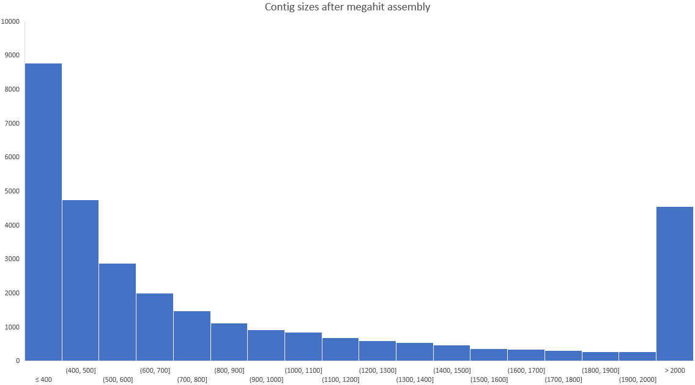
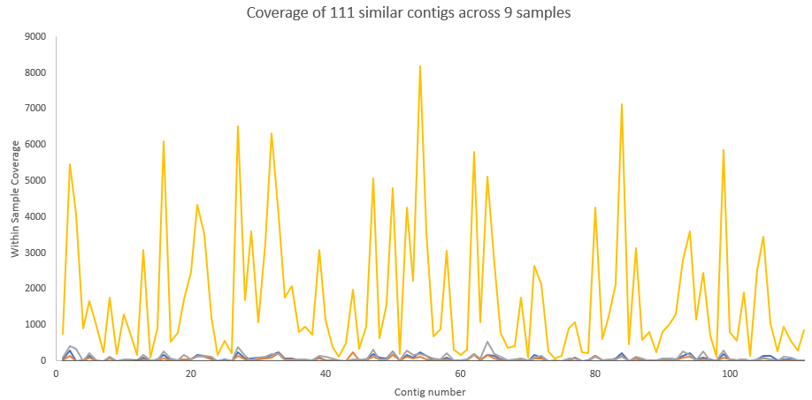
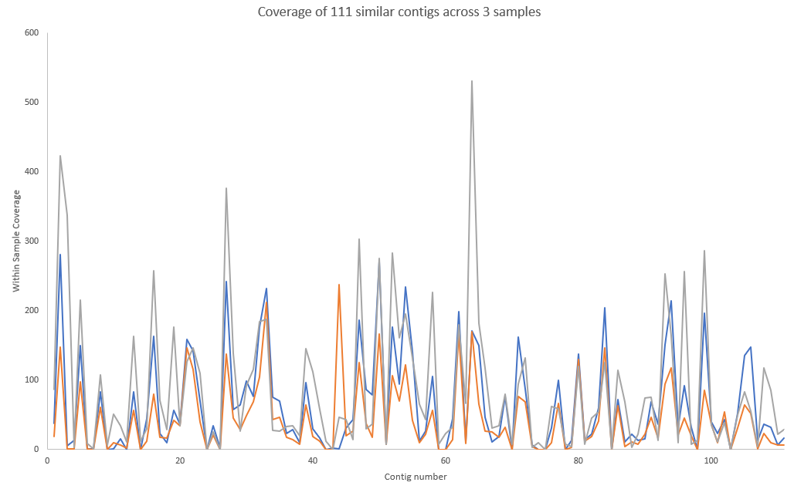

# SAGC Metagenomics Workshop, 2021

February 9<sup>th</sup>, Flinders at Tonsley, Adelaide, South Australia

# Metagenomics

We are going to jump right in with metagenomics, but [here is a brief introduction](https://linsalrob.github.io/ComputationalGenomicsManual/Metagenomics/) if you want to read something while Rob is talking.


We have created servers for you with all the software and data that you will need for these excercises. We are using the [human gut](../Datasets/gut) example data sets described here. Your instructors will provide details on how to log into the servers. If you can not log in, make sure you get some help!

We are going to step through a typical metagenomics analysis pipeline that you might run to see what is present in your data and to generate some metagenome assembled genomes. For each step, this manual provides detailed instructions, and there are also associated [YouTube videos](https://www.youtube.com/playlist?list=PLpPXw4zFa0uLMHwSZ7DMeLGjIUgo1IBbn) you can watch to learn more about the issues.

## [Quality Control and Preprocessing](../SequenceQC/) 


[QC and QA](../SequenceQC/) is the first step in making sure that you have good data analysis. Your result is only as good as your input.

This step will read the fastq files from the central location and save them in your account.

We iterate over each of the runs that have already been downloaded from the sequence read archive. Those runs are in `/data/gut/fastq`. First, we make a directory (`results/$SRR/prinseq`) to put the results, and then we run the prinseq command.

Lets break these parameters down and take a look. 

#### Filter on the length and overall quality

* `-min_len 60`   -- the minimum length of sequences to include. Assuming Illumina sequencing, you probably have read lengths between 150 and 300bp. Anything shorter will be a bad read. 
* `-min_qual_mean 25` -- minimum quality score for the mean of the read should be >25. (1 in 10^2.5 error ~ 1:300) which is about 1 bp error per read for 300 bp reads

#### Filter N's
Filter sequence with more than one N in the sequences. For Illumina reads, even a single N suggests a bad read.

* `-ns_max_n 1`

#### Remove exact duplicate sequences
For (non-16S samples) we would expect exactly duplicated sequences to be diminishingly rare, and they are most likely an artefact of the sequencing reaction. Some sequencing technologies (those that involve amplification) are much more prone to this than others. 

* `-derep 1`


#### Poly A/T Trimming 
You can remove poly-A and poly-T sequences at the end of the read with at least 5 A's. These can be an artefact of mRNA sequencing.

* `-trim_tail_left 5`
* `-trim_tail_right 5` 

#### Quality based trimming of the reads
You can trim based on min, mean, max, or sum quality scores. In this case, trim using the min score. We take a window of size `trim_qual_window` bp (so in this case 10 bp) and remove it if the 
score is less than stated. So in this case, we trim 10 bp off either end if the score is less than 30. We repeat that until we have a 10 bp window whose min score >= 30.

* `-trim_qual_type min`
* `-trim_qual_left 30`
* `-trim_qual_right 30`
* `-trim_qual_window 10`

#### Output options
Control where things are written:

* `-out_format 0`  - output either fastq (0) or fasta (1) format sequences. 

The file names of reads 1 (R1) and reads 2 (R2) for paired (R1/2), single (unpaired reads, e.g. if the other read fails quality) (S1/2), or bad (b1/2) reads 

* For the paired reads, we create new paired end files: `-out_good results/$SRR/prinseq/${SRR}_1.fastq -out_good2 results/$SRR/prinseq/${SRR}_2.fastq`
* For the singleton reads we write them to a single file: `-out_single results/$SRR/prinseq/${SRR}_single.fastq -out_single2 results/$SRR/prinseq/${SRR}_single.fastq`
* For the "bad" reads, we don't store them: `-out_bad /dev/null -out_bad2 /dev/null`


#### Input reads
We have paired reads, so we include both fastq and fastq2:

* `-fastq /data/gut/fastq/${SRR}_pass_1.fastq.gz -fastq2 /data/gut/fastq/${SRR}_pass_2.fastq.gz`

#### Threads
This just means use more computers!


```bash
for SRR in SRR3466404 SRR3506419 SRR3506420 SRR3546776 SRR3546778 SRR3546779 SRR3546780 SRR3546781 SRR3546782; do 
    echo $SRR; 
    mkdir -p results/$SRR/prinseq; 
    prinseq++ -min_len 60 -min_qual_mean 25 -ns_max_n 1 -derep 1 -out_format 0 -trim_tail_left 5 \
              -trim_tail_right 5 -trim_qual_type min -trim_qual_left 30 -trim_qual_right 30 -trim_qual_window 10 \
              -out_good results/$SRR/prinseq/${SRR}_1.fastq -out_good2 results/$SRR/prinseq/${SRR}_2.fastq \
              -out_single results/$SRR/prinseq/${SRR}_single.fastq -out_single2 results/$SRR/prinseq/${SRR}_single.fastq \
              -out_bad /dev/null -out_bad2 /dev/null \
              -fastq /data/gut/fastq/${SRR}_pass_1.fastq.gz -fastq2 /data/gut/fastq/${SRR}_pass_2.fastq.gz -threads 4;
done
```


### Output files

[prinseq++](https://github.com/Adrian-Cantu/PRINSEQ-plus-plus) outputs DNA sequences in (usually) fastq format that have the bad sequences removed. If you have paired end reads, there will be a file for each paired end, plus singletons files for reads where one end passed QC but the other did not. There is also a file for reads that fail QC, but in this instance we do not save those reads.

## [Who is there (part 1)?](../FOCUS)

For the first part of understanding which microbes are in the sample, we are going to use [FOCUS](../FOCUS/). 

This approach uses a heuristic to tell you what is in the sample. It doesn't map reads, but instead counts _k_-mers and maps those to a database of known genomes.

The options for this are straightforward: `-q results/$SRR/prinseq` is the output directory from prinseq, above, and `-o results/$SRR/focus` is where to write the results to. We use the default parameters for the rest of the operations, but you can also use a different _k_-mer size (by default _k_=6 and _k_=7 are installed in the servers). 


```bash
for SRR in SRR3466404 SRR3506419 SRR3506420 SRR3546776 SRR3546778 SRR3546779 SRR3546780 SRR3546781 SRR3546782; do
    echo $SRR;
    focus -q results/$SRR/prinseq -o results/$SRR/focus -t 4; 
done
```

### Output files

[focus](https://github.com/metageni/FOCUS) outputs comma separated files that contain the taxonomic information identified in your sequences. The proportions are summarised at different taxonomic levels. These `.csv` files can be imported directly into a spreadsheet program to graph or summarise the data. The output files are:


* output_All_levels.csv
* output_Kingdom_tabular.csv
* output_Phylum_tabular.csv
* output_Class_tabular.csv
* output_Order_tabular.csv
* output_Family_tabular.csv
* output_Genus_tabular.csv
* output_Species_tabular.csv
* output_Strain_tabular.csv

## [Who is there (part 2)?](../Kraken2)

For the second approach to understand which microbes are int he sample, we are going to use [Kraken2](../Kraken2).

This approach users _k_-mers to map the sequences in your sample to known genomes. It does this on a read-by-read basis.

There are [several databases readily available for Kraken2](https://benlangmead.github.io/aws-indexes/k2) and for this tutorial we have used the [Standard-8](https://genome-idx.s3.amazonaws.com/kraken/standard_8gb_20201202/inspect.txt) database (because it is smaller and so loads into memory). <small>To make life easier, we have set up kraken2 so that you do not need to provide the database name or location. If you install kraken2 yourself, you may need to add that here.</small>

Kraken also makes extensive use of the [NCBI Taxonomy](https://www.ncbi.nlm.nih.gov/Taxonomy/Browser/wwwtax.cgi) database.


```bash
for SRR in SRR3466404 SRR3506419 SRR3506420 SRR3546776 SRR3546778 SRR3546779 SRR3546780 SRR3546781 SRR3546782; do
    echo $SRR;
    mkdir -p results/$SRR/kraken/;
    kraken2 --paired --threads 4 \
    --report results/$SRR/kraken/$SRR.kraken_taxonomy.txt \
    --output results/$SRR/kraken/$SRR.kraken_output.txt \
    results/$SRR/prinseq/${SRR}_1.fastq results/$SRR/prinseq/${SRR}_2.fastq
done
```

### Output files

We have elected to output two files:

* `$SRR.kraken_output.txt` contains the [standard kraken output](https://github.com/DerrickWood/kraken2/wiki/Manual#output-formats):
    - A code (_C_ or _U_) indicating whether the read was classified or not
    - The read ID from the fastq file
    - The taxonomy ID assigned to the read if it is classified, or 0 if it is not classified
    - The length of the sequence in base pairs. Because we are using paired end reads, there are two lengths (R1\|R2)
    - A space-separated list of the lowest common ancestor for each sequence that indicates how many kmers map to which taxonomic IDs. Because we have paired end information, there is a `|:|` separator between the R1 and R2 information
* `$SRR.kraken_taxonomy.txt` contains the [standard kraken report](https://github.com/DerrickWood/kraken2/wiki/Manual#sample-report-output-format):
    - Percent of fragments at that taxonomic level
    - Number of fragments at that taxonomic level (the sum of fragments at this level and all those below this level)
    - Number of fragments exactly at that taxonomic level
    - A taxonomic level code:  `U`nclassified, `R`oot, `D`omain, `K`ingdom, `P`hylum, `C`lass, `O`rder, `F`amily, `G`enus, or `S`pecies. If the taxonomy is not one of these the number indicates the levels between this node and the appropriate node. See [the docs](https://github.com/DerrickWood/kraken2/wiki/Manual#sample-report-output-format) for more information.
    - NCBI Taxonomic name
    - Scientific name


#### Parsing the output files

We can use some simple `perl` and `bash` commands to parse the output files. For example, to show all the reads classified at the genus level and sorted by their abundance, we can use:

```bash
SRR=SRR3546782
perl -F"\t" -lane 'print if ($F[3] eq "G")' results/$SRR/kraken/$SRR.kraken_report.txt | sort -rg | less
```


## [What is there](../SUPER-FOCUS)

Super-FOCUS uses database reduction, _k_-mers, and faster computational algorithms to identify the _functions_ that the organisms are performing, not just who is there.

Super-FOCUS has a couple of options of databases and aligners that we could use, but for this workshop we have installed the `diamond` database at `90%` cutoff. This is a smaller, faster, database to use.

The options for Super-FOCUS are also quite simple, we provide the input directory with the fastq files, and the name of a directory for the output. We tell it that we want to use the diamond aligned, and that we will use four threads (computers):

```bash
for SRR in SRR3466404 SRR3506419 SRR3506420 SRR3546776 SRR3546778 SRR3546779 SRR3546780 SRR3546781 SRR3546782; do
    echo $SRR;
    superfocus -q results/$SRR/prinseq -dir results/$SRR/superfocus -a diamond -t 4;
done
```


### Output files

Analagous to the taxonomic levels we saw earlier, functions can be classified into a hierarchy. Super-FOCUS summarizes the different functions at different levels so you can choose which level to pursue in your analysis. There is one output file per level, and an overall summary too:

* `output_subsystem_level_1.xls` -- this is the file that you should import into excel
* `output_subsystem_level_2.xls`
* `output_subsystem_level_3.xls`
* `output_all_levels_and_function.xls`

In addition, Super-FOCUS leaves the intermediate files so you can compare them. The `m8` format is a "standard" format that is [widely used to describe sequence alignments]( 

* `$SRR.fastq_alignments.m8` - the raw m8 search output
* `output_binning.xls` - the raw output with every sequence and all its matches

### IMPORTANT

When `superfocus` has finished running, please delete the extra files to save space. This command will delete unnecessary files:

```bash
rm -f results/*/superfocus/*m8 results/*/superfocus/output_binning.xls
```


# [Metagenome Binning](https://linsalrob.github.io/ComputationalGenomicsManual/CrossAssembly/)

High-throughput sequencing is now so cheap and easy that most metagenomic datasets have multiple samples associated with them. We can take advantage of the vagaries of those datasets to create near-whole genomes from the sequences. Here we will walk through a manual approach to doing this, which highlights many of the steps involved. We will only use one feature - the coverage of the contigs in each sample. However, there are also several automatic tools that we and others have developed that help you do this and add more features such as di-, tri-, and/or tetra-nucleotide frequency, or similarity to known genomes.

## Assemble the contigs

We will use [megahit](https://github.com/voutcn/megahit) for the assembly in this tutorial, but there are [many other assembly](../SequenceAssembly) algorithms out there. Megahit is fast and does not consume a lot of memory. Even so, expect the assembly to take about 30 minutes to complete.

Before we begin, we are going to merge all the reads into two files: one for the R1 and one for the R2:

```bash
mkdir -p results/assemblies;
for SRR in SRR3466404 SRR3506419 SRR3506420 SRR3546776 SRR3546778 SRR3546779 SRR3546780 SRR3546781 SRR3546782; do
    cat results/$SRR/prinseq/${SRR}_1.fastq >> results/assemblies/R1.fastq;
    cat results/$SRR/prinseq/${SRR}_2.fastq >> results/assemblies/R2.fastq;
done
```

We can count the number of sequences in these two files to see that this worked:

```bash
countfastq.py -d results/assemblies/
```

*Note:* This code is part of the [](https://github.com/linsalrob/EdwardsLab) repo, and so is not a typical install.
This should give you these results:

```text
File name: results/assemblies/R1.fastq
Number of sequences: 1,905,491
Total length: 185,487,568
Shortest: 60
Longest: 100
N50: 100
N75: 100
[auN](https://lh3.github.io/2020/04/08/a-new-metric-on-assembly-contiguity): 97

File name: results/assemblies/R2.fastq
Number of sequences: 1,905,491
Total length: 182,509,047
Shortest: 60
Longest: 100
N50: 100
N75: 100
[auN](https://lh3.github.io/2020/04/08/a-new-metric-on-assembly-contiguity): 96
```

Let's assemble those all together using `megahit`. This reads the R1 file and the R2 file that we just created, and then outputs the results into `results/assemblies/megahit`. As before, we told it that we were using four threads. 


```bash
megahit -1 results/assemblies/R1.fastq -2 results/assemblies/R2.fastq -o results/assemblies/megahit -t 4 --min-contig-len 2000
```

**Note:** In this example, we are only keeping contigs over 2kb (2,000 bp). This still keeps plenty of contigs for later analysis, however if you are working on your own data, you might want to adjust this number. Here is a histogram of the number of contigs of different sizes. You should still have lots of contigs after assembly!



After running the assembly, these are the sequence statistics

Metric | 200 bp minimum contig length (megahit default) | 2,000 bp minimum contig length
--- | --- | ---
Number of sequences | 30,923 | 4,545
Total length | 43,360,390 | 26,358,476
Shortest | 200 | 2,000
Longest | 76,509 | 76,509
N50 | 3,131 | 7,628
N75 | 9,661 | 16,575
[auN](https://lh3.github.io/2020/04/08/a-new-metric-on-assembly-contiguity) | 8,041 | 12,791


### Mapping the reads to contigs

Now that we have contigs, we want to count how many reads from each sample so we can calculate the coverage. Again, there are [many choices of next gen mapping tools](http://cracs.fc.up.pt/~nf/hts_mappers/) but for this work we are going to use [minimap2](https://github.com/lh3/minimap2) because it is fast and with a lower memory footprint than some mappers.

First, we need to index the contigs:

```bash
mkdir -p results/mapping;
minimap2 -x sr -d results/mapping/contigs.mmi  results/assemblies/megahit/final.contigs.fa
```

and then next we need to run the mapping approach. We are going to do this for each sample, one at a time, and we not only do the mapping, but we create `.bam` files, which [are another common sequence alignment format](../SequenceFileFormats). 

```bash
for SRR in SRR3466404 SRR3506419 SRR3506420 SRR3546776 SRR3546778 SRR3546779 SRR3546780 SRR3546781 SRR3546782; do
    echo $SRR;
    minimap2 -ax sr results/mapping/contigs.mmi results/$SRR/prinseq/${SRR}_1.fastq results/$SRR/prinseq/${SRR}_2.fastq | \
    samtools view -@ 4 -b -F 4  | \
    samtools sort -@ 4 > results/$SRR/$SRR.contigs.bam;
    samtools index results/$SRR/$SRR.contigs.bam;
done
```


The command to search the reads against the contigs is `minimap2` and we tell it that we are going to use short read data (`sr`) and that we want the output in SAM format. Then we convert the SAM format to BAM format (`-b`) and only keep the reads that actually map (`-F 4` means drop unmapped reads). We sort the reads (`samtools sort`) before writing the files as `.bam` files. Finally, once we have written those files, we index them for very quick access in the next step.

### Count number of hits to each contig

For each sample we are going to make a table of the contig and the number of hits to that contig. This is easy to do with `samtools`:

```bash
for SRR in SRR3466404 SRR3506419 SRR3506420 SRR3546776 SRR3546778 SRR3546779 SRR3546780 SRR3546781 SRR3546782; do
    echo $SRR;
    samtools idxstats results/$SRR/$SRR.contigs.bam | cut -f 1,3 > results/$SRR/coverage.tsv
done
```

The [idxstats](http://www.htslib.org/doc/samtools-idxstats.html) command outtputs a tab-separated file with sequence ID, sequence length, number of mapped read-segments and number of unmapped read-segments, so here we just take columns 1 and 3.

### Merge all the count files into a single matrix-like file

We can easily merge these counts into one file. 

*Note:* This code is part of the [](https://github.com/linsalrob/EdwardsLab) repo, and so is not a typical install.

```bash
joinlists.pl results/*/coverage.tsv > results/all_coverage.tsv
```

We can take that matrix and open it in Excel to see how much coverage each contig has, and to plot graphs of the coverage.

### Calculate Pearson's correlation between some contig coverages.

Our longest contig in my assembly is the contig named `k119_21323` that is 76,509 bp (*hint: the `final_contigs.fa` file has the contig lengths in it!*), and so perhaps we would like to find contigs that correlate their coverage with that. 

We can calculate the Pearson's correlation between that contig and all the other contigs in the data set:

```bash
correlations.py  -l -r -f results/all_coverage.tsv -n k119_21323  > results/k119_21323.pearson.tsv
```

and now we can either import those correlations into Excel or another spreadsheet program or look at them in bash:

```bash
sort -k 3 -gr results/k119_21323.pearson.tsv | less
```

Next, we can filter to find those contigs that have a 0.99 or higher Pearson's correlation:

```bash
perl -F"\t" -lane 'print "$F[0]\n$F[1]" if ($F[2] > 0.99)' results/k119_21323.pearson.tsv | sort -u
```

and finally, we can make a coverage matrix of just those contigs:

```bash
perl -F"\t" -lane 'print "$F[0]\n$F[1]" if ($F[2] > 0.99)' results/k119_21323.pearson.tsv | sort -u | grep -Fwf - results/all_coverage.tsv  > results/k119_21323.coverage.tsv
```

This file should have ~111 entries each of which is correlated to the longest contig, k119_21323.

Here is a plot of the coverage maps, first against all samples which shows correlation separate from abundance

  

and then of just three samples showing highly correlated coverage.



### Calculate Pearson's correlation between contig coverages

> This is the same approach but for all contigs. It may take a while for the Pearson's correlation to be calculated depending on how many contigs you have (it is a _O_(n<sup>2</sup>) calculation!)
> 
> Graphs are good, but statistics is better! Lets calculate Pearson's correlation to see which contigs go together!
> 
> *Warning 1:* This code may take a little while to run. You should use *some* of the contigs as shown above.
> 
> *Warning 2:* This code is part of the [](https://github.com/linsalrob/EdwardsLab) repo, and so is not a typical install.
> 
> ```bash
> correlations.py  -l -r -f results/all_coverage.tsv > results/pearson_correlations.tsv
> ```
> 
> In this code, `-l` means that our file has a header line and `-r` means that the data is in rows (not columns), and hence to transpose the matrix.


#### Output

The output from Pearson's correlation is a pairwise list of all contigs, the correlation between them, and the p-value for that correlation.


# Challenge question

* Find a set of contigs that are highly related to each other
   - plot their coverage on a graph
   - take all those contigs and put them in a single fasta file. Annotate them [using PATRIC](https://www.patricbrc.org/). Are they a single genome?
   - take that fasta file and run [CheckM](https://ecogenomics.github.io/CheckM/) (also available [online](https://kbase.us/applist/apps/kb_Msuite/run_checkM_lineage_wf)). [More information](../CheckM).
   - what other information could you use to see if the contigs are related to each other or not?


# Other questions to consider

* How long does each program take to run?
  - why are some programs longer than others?
* Does every program give you the same answer?
  - why would the answers be different?
  - what kind of answers are you looking for?
* What do you think is happening in the samples?
  - how do the different samples within this dataset compare to each other?
* In hierarchical classifications (subsystems, taxonomy), which level should you choose and why?


# Running this all at once

(aka why you should always read to the end!)

This tutorial is designed to be hands on so that you get to run the code and _think_ about the inputs and outputs. However, in reality you should not do this as it is not easily shareable or reproducible. In addition, we installed all the software for you to make sure it works.

Nowadays, we encourage you to use a workflow manager for work like this, and we use [snakemake](https://snakemake.readthedocs.io/en/stable/) although there are other good ones. In addition, if you are installing this on your own cluster, you should install everything with `conda`. It just works!

[Here is a snakemake workflow](snakemake/process_metagenomesSAGC.snakefile) that does all these steps in one go. You just need to set up the directory with your fastq files, and `snakemake` will figure out how to do everything.

[Here is a snakemake workflow](snakemake/process_metagenomesSAGC_conda.snakefile) that does all these steps and uses `conda`. Note that you need to download the associated `yaml` files for the snakemake that you can get from [here](snakemake/envs.zip)
